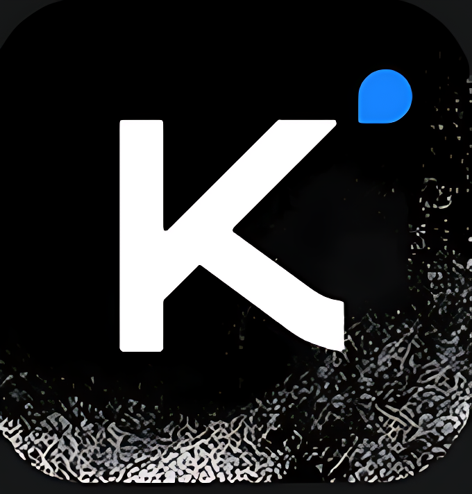
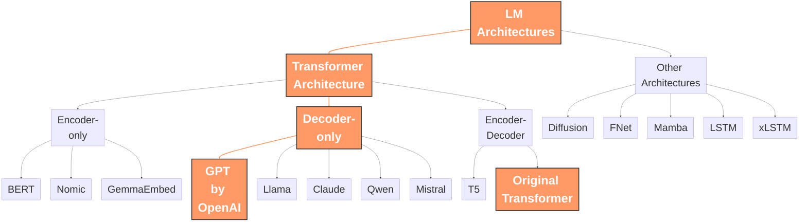
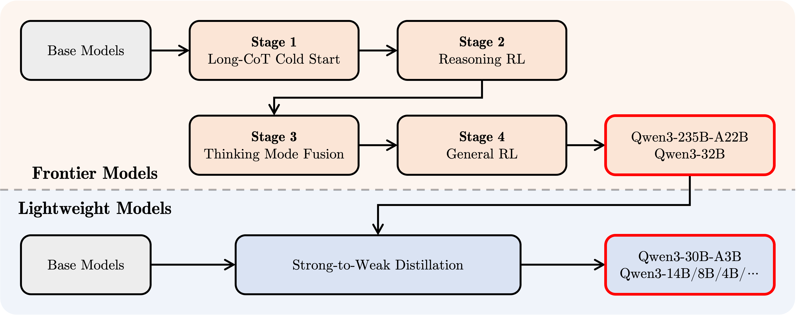

---
# try also 'default' to start simple
theme: seriph
# random image from a curated Unsplash collection by Anthony
# like them? see https://unsplash.com/collections/94734566/slidev
background: ./assets/bg.png
# some information about your slides, markdown enabled
title: LLM Literacy for Post-LLM Programmer
info: |
  ## LLM Literacy for Post-LLM Programmer
  An opinionated, practical guide to vibe-coding in a vibing world, where not leveraging AI is like choosing horseback over air travel.

  By AARMN The Limitless
# apply any unocss classes to the current slide
class: text-center
# https://sli.dev/custom/highlighters.html
highlighter: shiki
# https://sli.dev/guide/drawing
drawings:
  persist: false
# slide transition: https://sli.dev/guide/animations#slide-transitions
transition: slide-left
# enable MDC Syntax: https://sli.dev/guide/syntax#mdc-syntax
mdc: true
---

<!-- 
TODO:
- Licensing of these, open weight, open source, closed source, closed weight, ..., 
- Ollama, and hand on
- Open Web UI
- tangent technologies, git, docker, vector dbs, python, 
- good tooling vs common toolings
- update on techs
- update of current situation
- add quantization and LoRA
Know High-leverage tooling
key things to look for in an LLM
param count, context length, MoE, 

-->

# LLM Literacy for Post-LLM Programmer

An opinionated, practical guide to vibe-coding in a vibing world, where not leveraging AI is like choosing horseback over air travel. 

**2nd** Edition

<div class="abs-br m-6 flex gap-2">
  <a href="[Link to your socials/repo]" target="_blank" alt="GitHub"
    class="text-xl slidev-icon-btn opacity-50 !border-none !hover:text-white">
    <carbon-logo-github />
  </a>
</div>

---
transition: fade-out
---

# Who I am?

<div class="grid grid-cols-2 gap-8">
<div>

<!-- TODO: Add a picture of yourself or a relevant avatar -->


<div class="mt-4 text-center">
  <h3 class="text-xl">Alireza Mohammadnejad</h3>
  <p class="text-sm opacity-75">Guilan University AI Master's Student | LLM Enthusiast</p>
  <p class="text-sm opacity-60">Professional vibecoder (!) with a strong dedication toward optimization of workflows and automation</p>
</div>

</div>
<div>

Why should you listen to me (for the next two hours, anyway)?

<v-clicks>

- I used LLMs since first preview of InstructionGPT
- I've built a lot of cool stuff using LLMs.
- I use LLMs daily, and I wont tell you stop using LLMs
- I've made packages with (`pixelist`) and for (`vibecopy`) LLMs ...
- I improve my workflows constantly.
- I don't have an H100 GPU in the garage, just like you.
- My main goal: Demystify AI, Help you leverage it by "Least price" and "Highest yield"

</v-clicks>

</div>
</div>

---
layoutClass: gap-16
---

<div style="display: grid; place-items: center; height: 100%;">
  <h1>Let me Bring a News Slide from the First Edition of This Presentation</h1>
</div>

---
layoutClass: gap-16
---

<v-clicks>

# Let's Take a Look at Highlights of Announcements From the Last Week!

</v-clicks>

<v-clicks>

- <div class="flex items-center gap-2">
    
    AlphaEvolve <span class="text-blue-400">By Google</span>
  </div>
- <div class="flex items-center gap-2">
    
    Gemini Diffusion <span class="text-blue-400">By Google</span>
  </div>
- <div class="flex items-center gap-2">
    
    Bagel <span class="text-blue-400">by Bytedance</span>
  </div>
- <div class="flex items-center gap-2">
    
    Claude 4 models <span class="text-blue-400">by Anthropic</span>
  </div>
- <div class="flex items-center gap-2">
    
    Codex (New) <span class="text-blue-400">by OpenAI</span>
  </div>
- <div class="flex items-center gap-2">
    
    Gemini 2.5 Flash Preview (05-20) <span class="text-blue-400">by Google</span>
  </div>

## Therefore Keep in Mind

<AlertBox type="warning">
AI never sleeps, <s>and you shouldn't either</s>. Update your high leverage tools, but focus on learning fundamentals deeply!
</AlertBox>

</v-clicks>

<!--
Mention Gemma3n as well, which we can guess from its size, but no info about it is released and its format as a new unique format, never before seen.

Mention these is two path toward it based on this info
-->

---
transition: fade-out
---

<div style="display: grid; place-items: center; height: 100%;">
  <h1>Time Flies, Huh? What a Week That Was!</h1>
</div>

---
transition: fade-out
---

<div style="display: grid; place-items: center; height: 100%;">
  <div>
    <h1>This time, We Have Less Hot News, As It's Not Announcement Season, but...
    <span v-click>AI Never Slows Down, While Announcements Might</span></h1>
  </div>
</div>


---
transition: fade-out
---

# Let's Look at Hot News of Circa Last Month

<v-clicks>

- <div class="flex items-center gap-2">
    
    Gemini Pro 3.0 <span class="text-gray-400">(Codename <code>lithiumflow</code> in LMArena)</span> <span class="text-blue-400">By Google</span>
  </div>
- <div class="flex items-center gap-2">
    
    Gemini Flash 3.0 <span class="text-gray-400">(Codename <code>orionmist</code> in LMArena)</span> <span class="text-blue-400">By Google</span>
  </div>
- <div class="flex items-center gap-2">
    
    EmbeddingGemma <span class="text-blue-400">By Google</span>
  </div>
- <div class="flex items-center gap-2">
    
    <span :class="$clicks >= 13 ? 'text-red-400' : ''">GLM 4.6</span> <span class="text-blue-400">By ZhipuAI</span>
  </div>
- <div class="flex items-center gap-2">
    
    <span :class="$clicks >= 13 ? 'text-red-400' : ''">Qwen3 VL</span> <span class="text-gray-400"> (Varieties for size, quantization, thinking) </span><span class="text-blue-400">by Qwen (Alibaba Cloud) </span>
  </div>
- <div class="flex items-center gap-2">
    
    Claude Sonnet 4.5 model <span class="text-blue-400">by Anthropic</span>
  </div>
- <div class="flex items-center gap-2">
    
    Claude Haiku 4.5 model <span class="text-blue-400">by Anthropic</span>
  </div>
- <div class="flex items-center gap-2">
    
    <span :class="$clicks >= 13 ? 'text-red-400' : ''">Minimax M2</span> <span class="text-gray-400">(openweighted)</span> <span class="text-blue-400">by MiniMax</span>
  </div>
- <div class="flex items-center gap-2">
    
    <span :class="$clicks >= 13 ? 'text-red-400' : ''">Kimi K2 Instruct</span> <span class="text-gray-400">(09-05)</span> <span class="text-blue-400">by Moonshot AI</span>
  </div>
- <div class="flex items-center gap-2">
    
    <span :class="$clicks >= 13 ? 'text-red-400' : ''">DeepSeek V3.2</span> <span class="text-gray-400">(Exp)</span> <span class="text-blue-400">by DeepSeekAI (HighFlyer)</span>
  </div>
- <div class="flex items-center gap-2">
    
    <span :class="$clicks >= 13 ? 'text-red-400' : ''">Ling 1T and Ring 1T</span> <span class="text-blue-400">by InclusionAI (Ant Group)</span>
  </div>
- <div class="flex items-center gap-2">
    
    <span :class="$clicks >= 13 ? 'text-red-400' : ''">LLaDA 2.0 Flash Preview</span> <span class="text-gray-400">(Diffusion base)</span><span class="text-blue-400">by InclusionAI (Ant Group)</span>
  </div>

</v-clicks>
   
<v-clicks><div></div></v-clicks>

---
transition: fade-out
---

<!-- show duality of deepseek - zai - qwen - minimax - Inclusion AI - Kimi | Google - OpenAI - Anthropic - Meta - Ai2 - NVidia -  -->

---
transition: fade-out
---

<div style="display: grid; place-items: center; height: 100%;">
  <h1>We Look Deeper to Trends in The End!</h1>
</div>

---
transition: fade-out
---

# What I want you to take away?

<v-clicks>

- **What** is an LLM? <!-- (And how does it "think"?) -->
- How a **model** is different from a **provider**?
- How to **make** an LLM? <span class="text-gray-400"> (The 10,000-foot view) </span>
- Why LLMs are not a **fad**? 
- What is **todays and probably not tomorrow** (!) SoTA? <span class="text-gray-400"> (by vibes and benchmarks) </span>
- Why LLMs **on their own** are not a **silver bullet**? <span class="text-gray-400">(ft. LLM vs Human anatomy)</span> <!-- (downsides and how to mitigate them using The tooling and human element) -->
- Which workflows and toolings elevate LLM to next-level?
- How to Ask the right questions? <span class="text-gray-400">(Art, Philosophy, Psychology, Socialogy, AI and Engineering, of Prompting)</span>
- How to run a model on your very own system? <span class="text-gray-400">(Thy shall not kneel to big brother cloud!)</span>
- LLM and Security <span class="text-gray-400">(Attack vectors and opportunities + SLMs)</span>
- Quantization <span class="text-gray-400">(What? Why? Why not? How?)</span>
- Benchmarks 
- Whats next? <span class="text-gray-400">(Focused on trend insight not *Choo Choo* hype train)</span>

</v-clicks>

<!--
This is our roadmap. Each point will be expanded.
-->

---
transition: fade-out
---


<div style="display: grid; place-items: center; height: 100%;">
  <div>
    <h1>In the Next Few Slides, We Will See:
    <br><br>
    <div v-click>Theoretical Ingredients for a Model</div></h1>
  </div>
</div>

---
transition: fade-out
---

# Architecture

<v-clicks>

- The blueprint of how the model should function
- Similar to Classes in Programming, not an instance, but a scheme
- how parts interact and learn or not from data. It's the math and code of the machinery. It describes how model learns, often by tuning some internal "knobs" (parameters) based on the data it sees.
- Tells the How

</v-clicks>

---
transition: fade-out
---

# Parameters

<v-clicks>

- The internal "knobs" the model tunes during training
- More knobs = more capacity to learn nuance 
- Insight (often inferred data) is stored in here!
- this is the largest part of the final model artifact.
- A 70B parameters architecture, therefore, has 70 Billion **learnable** numbers, which model has learnt

</v-clicks>

<br>

<v-clicks>

# Hyper‌parameters

</v-clicks>

<v-clicks>

- What is the difference?
- Why not learn these?
  - We can't, as they are fundementally different! (efficently)
    - Hyperparameter sweep! (per use-case)
  - Gives us, per-use case, degree of freedom on inference stage, without a need for data

</v-clicks>

---
transition: fade-out
---

# Training Data

<v-clicks>

- Terabytes of text and code. 
- For SoTA models, basically, As big of a chunk, they can get off of Internet
- Differs from model to model, as architecture differ
- Training data differs, in **shape**, **quality** and **variety** per **use-case** and **stage of training** the model
- The pre-training phase is currently the most data hungry part of the process, quantity over quality (in LLMs)
- Data-quality and format in later stages matter alot more (in LLMs)

</v-clicks>

---

<div style="display: grid; place-items: center; height: 100%;">
  <div>
    <h1>And to Find the Correct Parameters... <span v-click>We Need Computation!</span></h1>
  </div>
</div>

---

<div style="display: grid; place-items: center; height: 100%;">
  <div>
    <h1>Before That, 2 Critical Words: <span v-click>Inference and training</span></h1>
  </div>
</div>

---

# Physical Ingredients for a Model

<v-clicks>

- **Computation**: The raw power for calculation, in both learning and inference
  - Learning models require learning from data, before or interleaved with their inference stage
  - The inference itself requires computation
  - This ~~is~~ was the most expensive stage computationally for SoTA LLMs
  - What the is becoming was means for AI?

- **Energy**: Deeply entangled with computation
  - Training and inference at scale require significant energy resources
  - Many tech companies in the AI boom are building their own power plants due to sheer demand

- **Hardware**: AI computation requires specialized hardware
  - Often embarrassingly parallel, making GPUs far better than CPUs with current architectures

- **Experts!**

<!-- and ALL‌ THESE‌ Points tooooooo -->

</v-clicks>


---
transition: fade-out
---

# A little analogy

<v-clicks>

### Human child

</v-clicks>

<v-clicks>

- **Architecture**: DNA, the blueprint of how the child should function, how parts interact and learn or not from data.

- **Parameters**: The internal "knobs" the child tunes during learning, from birth to adulthood. this can be their neurons connections, their muscles shape, ...

- **Training Data**: The experiences, interactions, and observations the child encounters from birth to adulthood. This data shapes the child's understanding of the world and how they interact with it.

- **Computation and Energy**: The child's brainpower and the energy it expends to learn and grow. handled by the food they eat. It's the rolling of DNA into a human being which happens since egg cells forward, powered by energy and chemical reactions.

</v-clicks>

---
transition: fade-out
---

# Commonly Used Jargon: Decoding the Lingo

<v-clicks>

- **Language Model (LM):** Any system (often AI-based) that models (understands and/or generates using probabilities) human language. Anything from autocompletes from a decade ago, till modern giants.

- **Large Language Model (LLM):** An LM, but **BIG**.
  - **Large** in terms of:
    1. **Parameters**: more than ~~100 million~~ ~~1 billion~~ 10 billion <!-- main ingredient of the Large badge -->
    2. Training Data (have terabytes to petabytes of training data)
    3. Generalized capabilities (across tasks, domains, languages)

- **Multimodal / VLM (Vision Language Model):** LMs that can process and understand information from multiple types of data, not just text. Common combo is text + images.
  - *Examples:* GPT-4o (closed-weight), Llava (open-weight).

- **Base Model** vs **Instruct-Tuned/Chat Model**

</v-clicks>

---
transition: fade-out
---

# Commonly Used Jargon: Decoding the Lingo

<v-clicks>

- **confabulation** vs **hallucination**

- **ASI** and **AGI**

- **Reinforcement Learning**, **Supervised Learning**, **Unsupervised Learning**, **Self/Semi-Supervised Learning**

- **Small Language Model (SLM)**

- **Model Collapse**: Concept dervied from wave function collapse to describe a model with lack of any creativity or divergence, fully memorized deterministic system

- **SoTA (State-of-the-Art)**: The best-performing model/technique for a specific task *right now*.

- **Cutting-edge/Bleeding-edge**: Very new, promising, but maybe not fully proven or widely adopted SoTA.

</v-clicks>

--- 

# Commonly Used Jargon: Decoding the Lingo

<v-clicks>

- **Diffusion**: An architecture which is commonly used in image generation but recently is being explored for text, its main ability, is speed and non‑autoregressive generation, making it perfect for blank filling, and probably, style transfer of text. 

- When I mention **transformer model** or **diffusion model**, I mean a model *built on top of* transformer or diffusion architecture assumptions, these architectures clarify the core-ideas so exact param count and structure from model to model differ, e.g.: llama4 architecture, deepseek v3.2 architecture.

- Modular systems naming hell (e.g.: Linux)

- Arch (A gnu/linux distro) : Kernel (Linux/Hurd) + Coreutils (rust, gnu) + Package Manager (pacman) + Init system (systemd) + ...

- Kimi K2 (A gpt-transformer model) : Architecture (Transformer, GPT) + Exact Architecture (elicitation with exact layer count, params, ...) + Optimizer (Muon) + Numerical Precision (FP16/FP32) + Datasets (Pile/Wikipedia/...) + ... 

</v-clicks>

<!--
Presenter Notes for "Commonly Used Jargon":

- Language Model (LM):
  - Vibe check: The OG, could be anything from n-grams to simple neural nets.
  - LM is the foundational concept.

- Large Language Model (LLM):
  - Vibe check: The current rockstars. GPT-4, Claude 3, Gemini, Llama 3.
  Billions (sometimes trillions!) of internal "knobs" the model tunes during training. More knobs = more capacity to learn nuance (and also more to go wrong!).
  Terabytes of text and code. The internet, basically.

  - Emphasize the scale difference (Parameters, Training Data) and its implications.

- Multimodal / VLM:
  - Vibe check: "My LLM can see now! And it's judging my messy desk."
  - This is where things get really interesting – beyond just text. Mention examples.

- SoTA / Cutting-edge / Bleeding-edge:
  - Vibe check: SoTA is what you use for production. Bleeding-edge is what you brag about on X/Twitter.
  - Clarify these terms as they are often used loosely. The "right now" part of SoTA is key due to rapid changes.
-->

---

# A Skewed Map of Language models Realm

<v-clicks>



<AlertBox type="warning">
  This is a skewed map of the LLM realm focused on Assistants and modern LLMs. It's not meant to be exhaustive, but rather to give you a sense of the landscape.

  From now on, "AI" and "LLM" by default points to Decoder-only, Attention-based Transformers, a revision of OpenAI, on Transformers paper called "Attention is all you need" by Google Deepmind
</AlertBox>

</v-clicks>

---
layout: two-cols
---

# So, What is a GPT (Decoding Transformer)?

<!-- TODO! -->

<v-clicks>

- Next word prediction system!
- Tokens!
- Context!
- Parallelism!
- **Relatively** Uncapped Learner!

</v-clicks>

<br>

<Youtube v-click id="9uw3F6rndnA?start=25" width=90% height=40% />

::right::


---

# I Want to Make One!

Making an LM, is a great project for a resume, but, making an LLM is a financial and technical **mission impossible**. It's a *monumental* undertaking. Not your bachelor's degree project 

<!-- (unless you're a FAANG with a spare million or billion, or of the likes of Terry A Davis). -->

**The Typical Lifecycle:**

<v-clicks>

1. **Data Collection & Curation**
  - Use public datasets on 🤗HuggingFace and Kaggle (won't be enough for SoTA LLMs)
  - Download Everything off the Internet! (including copyrighted material and personal data 😉)
  - Preprocess data (deduplicate, source balancing, interleave, safety filtering, ...)

<br>

2. **Pre-training (Foundation Model)**
  - pick/design architecture, tokenizer, ...
  - Write some code, do some math!
  - Throw your Dataset to your model!
  - Iterate with checkpoints and evaluation, till it learns to predict next words
  - Be in debt for thousands of dollars 🙂

</v-clicks>

---

# I Want to Make One!

<v-clicks>

3. **Fine-tuning (Instruction Tuning & Alignment):**
  - The list of techniques in this section is so long, I won't even try to list them! (we see some later on)

<br>

4.  **Evaluation & Red Teaming:**
  - Test on benchmarks, human evaluations.
  - **Red Teaming**: Try to make it say bad/wrong/biased things to find and fix flaws.

</v-clicks>

<br>

<AlertBox v-click type="success">
This is why building a <b>competitive</b> LLM from scratch is mostly for mega-corps or well-funded research labs. Most of us will be <b>using</b> or <b>fine-tuning existing</b> models. (Including Iranian LLM projects you see in the wild, in which, you can see the puffy, cute <b>tail of llama</b> come off)

But surely, creating LLM is not impossible! Specially with dedicated, smart, dilligent and curious researchers and a few hundred thousands dollars dedicated to R&D (a single pretraining run of a 7B model on limited data, costs roughly <b>5000 dollars</b>!)
</AlertBox>

<!-- 
    - Scrape the internet (Common Crawl), books, code, articles.
    - **Cleaning & Filtering:** Remove PII, hate speech, low-quality content. This is CRUCIAL and hard.
    - *Vibe:* Digital dumpster diving, then gold panning.

        - Goal: Learn general language patterns, grammar, facts, reasoning.
    - Method: Self-supervised learning (e.g., predict masked words, next sentence) on the massive curated dataset.
    - Hardware: Thousands of GPUs running for weeks/months. $$$$$!
    - *Result:* A "foundation model" that knows a lot but isn't very good at following instructions yet (e.g., GPT-3 base).

    Train on high-quality instruction-response pairs (e.g., "Q: Summarize this. A: [summary]"). Makes it follow instructions.
    - **Reinforcement Learning from Human Feedback (RLHF) / Direct Preference Optimization (DPO):**
        - Humans rank different model responses to the same prompt.
        - A "reward model" is trained on these preferences.
        - The LLM is further tuned to maximize scores from the reward model.
        - Goal: Make it more helpful, harmless, and honest.
    - *Vibe:* Sending the raw genius to finishing school.
-->

---

###### borrowed from Julia Turc Youtube channel


---

# Ok, Let's Explain Those Tuning Techniques a bit!

<!-- TODO! Finetuning, comments get rid of, fine tune and evaluate clarify, clarfiy what we talk about and what we dont talk about -->

- Fine-tuning Steps!
  - Supervised Fine-Tuning (SFT)
  - Reward Modeling (RLHF / DPO)
  - Preference Tuning (PPO)
  - GPRO
  - CoT
  - Hyper
- Making small models go further
  - Knowledge Distillation
  - Quantization
- Making all models go further
  - Chain of Thought

---

# A Deep-dive for AI Enjoyers

###### An example from Qwen 3 Architecture Blog Post




<!--
وقتی این مدلا تازه ترین شدن فقط می‌تونند کلمه بعد رو بهمند
-->

---
layout: center
effect: fade
---

# What is in the Magic Box?

## A Lot More, But We Got No Time For:

<br>

- Attention Mechanism
- Cold-Start
- Fine-Tuning In Code
- Math
- Optimizers
- Magic and Spells

## Atleast Today!

---
transition: fade-out
---

# Why LLMs are NOT a Fad

<!-- lossy compression -->

<v-clicks>

### Why Industrial Revolution Succeeded?

It elevated the physical strength of human in specific operations, which boosted manufacturing.

### How Computers Revolution Succeeded?

It elevates the computational strength of human in specific operations, which boosts knowledge work.

### How AI Revolution ... ?

It elevates the cognitive strength of human in specific operations, which automates knowledge work.

<AlertBox type="info">
Just like computers, electricity and steam engines, LLMs are a general solution for a diverse set of problems!
</AlertBox>

</v-clicks>

---
transition: fade-out
layout: center
---

# LLMs are No More Specialist AI, they are Generalist

###### This is my personal opinion

---
transition: fade-out
---

# Why LLMs are NOT a Fad

<v-clicks>

### But, It can't write good code? right?!

If you mean outdated code, sure, it's still an open problem, but in the right, agentic environment, it can write better code than 90% of programmers, and if context-length issue and knowledge recency and confidence issues somehow be resolved or mitigated, it can write better code than 99% of programmers.

### I want to know my code details fully and Engineer it, don't take that away from me!

Well, with that mentality you can never be a good technical-lead engineer, you can't write all the code, you barely can read all the code! if you can't verify LLM code, you can't verify a junior code when you are a senior either! Communicate with LLM, just like a human, assuming that person has dementia and write code super fast! Also with that mentallity, you probably should use ASM for full control! or atleast study compiler throughly

</v-clicks>

---

<div style="display: grid; place-items: center; height: 100%;">

<div>
<h1>An Assumption to Accept</h1>

<div>

LLMs are not mainly a replacement for human intelligence, but they are a replacement for human effort. It doesn't mean they are not intelligent, it means if you are not visionary, you are doomed! You can't out-compete a computer in speed of typing or count of doc pages read per minute, The same way, you can't out-run a car, or out-power a nuclear reactor! Hoping they wont get better by day and eventually catch-up in all aspects, well, sounds quite hopeless to me!

<!-- Unless there be a nuclear war -->

</div>
</div>
</div>

---
layout: center
---

# If Definition of a limit is Being fidgeted with, that limit probably is surpassed already!

<v-clicks>

###### What is Art?


###### Is Human Creativity Special?


###### Is Human Intelligence Special?


###### Can Machine Surpass us?

###### When AI will be, an AGI or ASI?

</v-clicks>

---
layout: center
---

# Singularity is not over the horizon, it's here!

---
layout: center
---

# One more reason, why it's not going anywhere, anytime soon


<v-clicks>

You are probably using it! and by demand, comes the market!

It's just a matter of lowering the price enough!

So, yeah, this is not NFT bubble (sorry not sorry).

</v-clicks>

---
layout: center
---

# But LLMs, are NOT The Ultimate Silver Bullet!
###### At the very least on their own!

---
layout: center
---

# To Understand Why, Let's Look at Our‌ Differences with LLMs!

---
layout: center
---

# But Before That, Let's Listen to Andrej Karpathy Take on It!

---
transition: fade-out
---

<Youtube id="lXUZvyajciY?start=552" width="100%" height="100%" />

---
transition: fade-out
---

<div style="display: grid; place-items: center; height: 100%;">
  <div>
    <h1>Now, Equipped with Knowledge, Let's Take Another Look to LLM's vs Us: <span v-click>The Dichotomy!</span></h1>
  </div>
</div>

---
layout: center
---

# Moravec's paradox

Why some stuff which are easy to us are hard to computers and things hard to us are easy to computers? 

---
layout: two-cols
---

# The Dichotomy!

- **Biology Architecture**: 
  - Humans and animals, have a lot information baked into their neural pathways
  - For example: A zebra can run a few minutes after birth!
  - There is surely not enough time and data to learn that level of muscle control from ground-up in that time!
  - Approach Difference of AI and Biology <!-- While models, just have a super general algorithm, therefore, more information of humans and animals, are in the architecture itself, humans evolve using meta-architecture of evolution, and this sort of explain-->
  - Evolution meta-architecture
  - Computer Game vs Physics Simulation Example <!-- more on it, example of game development vs physics simulation on computational efficency of realistic things, it takes a few billion years and more than universe GPU to simulate a full universe XD -->

::right::

<div class="pl-4 text-left">

# Which Means

### Humans 💪

- General intelligence (More insight on general patterns)
- Agentic and online
- Qualia and Sentience (AI hopefully doesn't)
- Alot more efficent

<br>

### LLM 🦾

- Simpler and Faster
- Not good in calculations (in compairson to humans and classic computing)
- Less entangled with host machinary

</div>

---
layout: two-cols
---

# The Dichotomy!

- **AI‌ vs Huamns, How we **differ** in learning and memory?**
  - Human's vs LLM's Memory and LLM's duality of learning <!-- Training, vast, slow, costly, deep, vs In-context learning, fast, zero-shot, shallow, ephermal, cheap, e.g.: RAG ||| learning is basically intertwined with active memory , pre-learnt things by evolution, as mentioned before-->
  - Humans superior online learning, sleeping is our online learning superpower?<!-- Abstract Fatal familial insomnia (FFI) is a familial prion disease linked to a mutation of the prion protein gene. Neuropsychological investigations in seven patients with FFI belonging to two different families showed that the main behavioral and neuropsychological features are (1) early impairment of attention and vigilance, (2) memory deficits, mainly of the working memory, (3) impairment of temporal ordering of events, and (4) a progressive dream-like state with neuropsychological and behavioral features of a confusional state. Neuropathologic examination of six patients showed prominent neuronal loss and -->

- **Efficent Online Learning** vs **Efficent In Context Training**
  - Human's Learn Mainly Online

- **Long but Lossy Context** vs **Accurate but Limited Context Learning/Recall**

::right::

<div class="pl-4 text-left">

# Which Means

### Humans 💪

- Less **Confabulation** (جعل‌ خاطره)  <!-- - They can make stuff up *very confidently*. They are optimized to produce plausible text, not necessarily *true* text, why the word matter-->
- More unified memory sense <!-- our short-term and long-term memory blend in better, they have static, and in context static memory, no short-term and long-term memory, to mimic this we need to add forgetting or note taking to models, current approachs like rag is like having a book-store and looking into them for the right thing fast -->
- Better and Faster online parameter learner <!-- We actually change beyond context, models just change in context, a fresh context, and you get a fresh model, no internal knob changes even in chatgpt memory, its just text passed as preamble like the memento movie -->
- No Hard Context Limit (Seamless context management) <!--   - Can only "remember" a certain amount of text (the context window). Getting MUCH better (e.g., Gemini 1.5M tokens, Claude 200k), but still a factor for very large tasks. Humans have smart context purge which LLMs currently lack -->
- Better reflection

<br>

### LLM 🦾

- Super Vast Knowledge <!-- It take us over 2000 years to read what llms read to kick start themselves, but they dont learn them efficently/rigorously -->
- Super Fast Reader <!-- on the right hardware they can fly, 1000tok/s, thats faster than fastest writer and readers even assuming languages with bad optimization like farsi -->
- Better than average human in-context
- Can code / pick style faster

</div>

---
layout: two-cols
---

# The Dichotomy!

- **Integrated Actuators and Sensors** vs **Physically Detached by Default**
  - Human are **by now** highly multi-modal compared to MLLM
  - LLM's only IO -aside from its hardware computation foodprint- is Text (or Media for Generative MLLMs)
  - Physical Actuators Make a HUGE Difference! <!--compare a person who needs to make a robot, send its PCB‌ for manufactoring or buy it off amazon to then get napkin while you just standup and take it, assuming you dont have accessibility-->
  - How This Can Become AI's Greatest Strength! <!-- Zero cost copy, infinite limbs, assuming low latency bus, also super duper dangerous -->

::right::

<div class="pl-4 text-left">

# Which Means

### Humans 💪

- Better motor skills
- More multimodal (Vision, Audition, Olfaction, Gustation, Tactition, Proprioception, Thermoception, Nociception)
- Deeper integration with physical desires for survival (Hunger, Danger, Fear, ...)

<br>

### LLM 🦾

- More modular
- Less dependent to physical, whioch means agility and speed
- Shallower integration with physical desires for survival (Hunger, Danger, Fear, ...)

</div>

---
layout: two-cols
---

# The Dichotomy!

- **Agency, Survival, Mimicing, Thinking Steps**
  - Survive demands agency, mimicing doesn't!
  - The 2 camps: if it quacks like a duck, it is a duck?
  - We are processing, always, LLM's currently (are forced to) play pingponging <!-- mention how its probably not inherent but artifact of lack of data and how it all started + safety -->
  - Clear vs Unclear Goal, Machinary and Seperation of Concern
  - A native cron service is up in our brain! <!-- AI can't schedule a thing to do! -->

::right::

<div class="pl-4 text-left">

# Which Means

### Humans 💪

- Existential and Perpetual Continuation
- More grounded, True world model
‌- Also, Less Hallucination (توهم) and Confabulation (جعل‌ خاطره)

<br>

### LLM 🦾

- Cheaper replication of knowledge and scaling
- Easily swapable for tasks
- More disposable

</div>

---
layout: center
---

# LLMs are NOT Silver Bullet

They're incredibly powerful, but they're not magic. Think of them as brilliant, hardworking, and sometimes erratic, interns with great general-knowledge but not much of domain-specific experience, and they forget nearly everything the next day you visit them!

---

# Problem & Mitigation

<v-clicks>

<!-- we are not looking change architecture answer here, that will be a viable answer per each -->

- **No native motory skills** $\Longrightarrow$ Go Big (svg drawing exam) - Auxilary models - Native movement tokens (e.g.: MolmoAct) - Math/Spline/Svg training/techniques for models (e.g.: xVal)

<br>

- **Few multimodal sensory variance (Vision, Audition, Olfaction, Gustation, Tactition, Proprioception, Thermoception, Nociception)** $\Longrightarrow$ Joint Embedding (Data collection) - Online encoder training - Layering Insight in Model (e.g.: Fine-tuning MMS Adapter Models for Multi-Lingual ASR)

<br>

- **Existential and Perpetual Continuation** $\Longrightarrow$ Agentic Loop - Memory - Fine-tune on continuous input models - Context extension techniques - Context

<br>

- **Confabulation and Lack of world grounding** $\Longrightarrow$ Fine-tuning (RLVR) on false recalls - RAG/External access - Verifier model/software - Voting (Cross model, Self-Consistency Voting, Attention-Based Voting) - Cognitive core extraction

</v-clicks>

---

# Problem & Mitigation

<v-clicks>

- **Short active memory, not inferring long-term personalized insight or learning** $\Longrightarrow$ Memory - Personalized Quantization - Continual Learning (e.g.: RecLoRA - FedP²EFT - I-SHEEP - STeP - C-LoRA - Continual Learning via sparse memory finetuning (meta paper)) - 

<br>

- **No Hard Context Limit (Seamless context management)** $\Longrightarrow$ Infini-attention - StreamingLLM: Attention Sinks - ReAttention - EM-LLM: Episodic Memory

<br>

- **Better Reflection, General Intelligence, Lack of Strategy and Planning** $\Longrightarrow$ CoT - RLVR (Reinforcement Learning with Verifable Reward, High-entropy Minority Tokens branching) - GPRO (Group Relative Policy Optimization) - Deeper Beam Search - Test-driven thinking approaches - Goal-driven RLVRs with incremental rewards

<br>

- **Humans are more power efficent** $\Longrightarrow$ Sparsity - Quantization (bitnet, GGML, We see more later) - Distillation

</v-clicks>

---

# Problem & Mitigation

<v-clicks>

- **Lack of purpose alignment** $\Longrightarrow$ Smart RL‌ based Fine-tuning tricks - More highquality SFT data

<br>

- **Deeper integration with physical desires for survival (Hunger, Danger, Fear, ...)** $\Longrightarrow$ Some RL and SFT Techniques (Please don't 🙂, learn something from movies)

<br>

- **Qualia and Sentience (AI hopefully doesn't)** $\Longrightarrow$ Thankfully, no one has a clue (Please don't 🙂, Again)

<br>

- **Special one: Explainability (XAI)** $\Longrightarrow$ Unlike other weaknesses this one is a feature we demand, not because it empowers it, rather because it empowers us when to pull the plug! (Research Safety, get Quantization and Alignment as bonus) $\Longrightarrow$ "Mapping the Mind of a Large Language Model" by Anthropic


</v-clicks>

---

# Doubling Down!

**There is also, fields which amplify AI current leads even further**

<v-clicks>

- **go faster**
  - special hardware: Cerebras
  - other architectures: diffusion LLMs 
  - Agentic Systems with LLMs and SLMs
- **scale better**
  - Mixture of Experts (MoE)
  - Virtual MoE fusion
  - Model merging techniques
- **Alot more**

</v-clicks>

---

# Tool-calling

**better tool calling capability and tooling** can mitigate all issues, and enhance all qualities, so I didn't list it per item, as it would have been member of nearly every item

<v-clicks>

- search access: less confabulation, more grounded, information cut-off issue which is related to lack of online and continous learning
- browser-use: take real world action indepenet of humans, making them more agentic
- RAG is basically some type of tool calling
- Structured output + tooling = in app integrations

</v-clicks>

---
layout: two-cols
---

# MCP

<v-clicks>

- What it is
- What it isn't
- Transport <!-- cli and http, has different modes of operation -->
  - HTTP
    - SSE
  - stdio
- Opportunities
  - Clients
  - Servers
  - Markets (Smithery.ai)
  - Enabled Models
- Interesting stuff <!-- browser use, deepwiki -->

</v-clicks>

::right::

<v-clicks>

### MCP Snippet

</v-clicks>

<v-clicks>

###### Client

```python
import asyncio
from mcp import ClientSession, StdioServerParameters
from mcp.client.stdio import stdio_client

async def main():
    async with stdio_client(StdioServerParameters("python", ["server.py"])) as (r, w):
        async with ClientSession(r, w) as s:
            await s.initialize()
            print((await s.call_tool("datetime", {})).content[0].text)

asyncio.run(main())
```

###### Server

```python
from mcp.server.fastmcp import FastMCP
from datetime import datetime

mcp = FastMCP("DateTime")

@mcp.tool()
def datetime():
    return datetime.now().isoformat()

mcp.run(transport="stdio")
```

</v-clicks>


---
transition: fade-out
layout: center
---

# Key points
1. SLMs and even LLMs are a component of solutions, even if they are major components, you need to engineer them into a good framework, or make frameworks so they can make better frameworks for themselves (toward singularity)
2. Human expertise is ~~king~~ regent at the moment

---
transition: fade-out
---

# Model vs. Provider: Who's Who?

This is a common point of confusion, specially for non-technical people. Let's clear it up.

<v-clicks>

- **Model:** The actual AI, the "brain." It's the result of the training process.
    - *Examples:* `GPT-4 Turbo`, `Claude 4.1 Opus`, `Kimi K2`, `Llama 4 Scout`.
    - These are specific versions with defined capabilities and architectures.

- **Provider (or Product/Service):** The company or platform that hosts the model(s) and provides access, often via an API or a user interface.

</v-clicks>

<AlertBox type="info" title="Analogy Time!">
Think of it like cars:

- **Model:** Ford Focus ST (the specific car with its engine, features)
- **Provider:** The Ford Dealership (where you get it), or Hertz (if you're renting access to drive it).

</AlertBox>

---

# What a Provider Does?

- Run the model(s)
- Provide an API (or a chat interface)
- Tooling for the model
  - Search-engine results for overcoming cut-off
  - Vector DB to query relevant materials
  - Code Runner
- Handle billing and access control
- Handle auxiliary services
  - TTS for hearing answers (another AI!)
  - STT for typing using voice (even another AI!)
  - Memory services
  - Set the right hyperparameters
  - Image gen, ...

---
transition: fade-out
layout: two-cols
---

# Common Hyperparameters (in LLMs)

- Temperature
- Top K
- Top P
- Token/Logit Bias

<div class="half-br"></div>

***

<div class="half-br"></div>

- Max Tokens
- Min Tokens
- Presence Penalty
- Frequency Penalty
- Beam Search Settings

<div class="half-br"></div>

***

<div class="half-br"></div>

- Json Mode and Tool call Settings

::right::

<div class="pl-4 text-left">


Assuming $\text{logit}_i = z_i \quad$ ,
$
\quad \text{scaled logit}_i = \frac{z_i}{T} \quad 
$

We will get:

$$
P_i = \text{softmax}(z/T)_i = \frac{e^{z_i / T}}{\sum_{j=1}^{n} e^{z_j / T}}
$$


Where $n$ is Vocab size and $T$ is Temperature


###### In LLMs Hyperparmeters are often not that intertwined with the model architecture, like some of the other architectures, e.g.: K-means, yet it's interesting to know them


</div>

<!-- formula, card, realization -->

<style>
  .half-br {
    display: block;
    height: 0.5em; /* or 4px, depending on your font size */
    content: "";
  }
</style>

---

<SamplingCard />

---
layout: center
---

<h1> <b>Lets go</b> <GradientText>Vibing!</GradientText></h1>

"Vibecoding" is a term coined by Andrej Karpathy

---

# Know the Labs

<AILabsGrid />

---
layout: default
---

# Categories (My Take)

- General Chat and Specialized Chat <!-- Gemini, Google AI Studio, Chatgpt, Claude, Grok, Z (Zhipi) AI, Le Chat, Kimi AI, baidu, minimax ai, Deepseek, cohere, Ai2 Playground, liquid labs, microsoft copilot, HuggingChat, Cerebras Inference, groq, morphic, lumo by proton, duck.ai, lmarena, LLMChat.co, Github copilot, pi, poe, diffychat, librechat, free chat llm, giz.ai, lobohub -->
- Useless apps of chat <!-- if computer-use comes into play there might be a point -->
- Browser <!-- Comet, Atlas, ..., browser is closest thing to an OS, without hardware troubles -->
- Note <!-- Notion, NotebookLM , ...-->
- Iranian General Chat <!-- Hooshang, Metis,  -->
- AI Search Engine <!-- chatgpt, perplexity, you.com, phind.com -->
- Agents <!-- Kimi OK‌ Computer, manus, genspark -->
- Vibe in CLI
  - model/provider centeric <!-- (Auggie, Rovo, Qwen, Gemini, Github) (Codex, Claude, Kimi, Grok) -->
  - model/provider agnostic <!-- (Crush, Mods, Aider, OpenCode, Goose, agenticSeek) -->

---

# Categories (My Take)

- Vibe Studio
  - front-end/designer web development <!-- zoer, anything, bolt.new, trickle AI, create.xyz, perplexity lab, lovable, Deepsite v2 (hfspace), lmarena, framer, same, groq appgen -->
  - fullstack web development <!-- base44 -->
  - mobile development <!-- dreamflow (flutter), rork (expo + react native) -->
  - Everything <!-- firebase studio -->
- Async Agent <!-- Devin, Jules -->
- AIDE
  - based on vscode <!-- (kiro, trae, windsurf, void, cursor) -->
  - not based on vscode <!-- (zed) -->
- VSCode Extension <!-- (Continue AI, Augment Code, Kilo Code, Copilot, Cline, Roo Code, Blackbox, Lingma (qwen), windsurf/cursor/..., cerebras) -->
- Offline Inference, Agent and Unifier <!-- ollama, msty, lm-studio, cherry studio --> <!-- g4f  --> <!-- open-webui --> <!-- Jan, OpenHands -->
- Github App <!-- Code Rabbits, ... -->
- Vibe Service <!-- gitingest.com, into.md, vibecopy extension -->

---
layout: center
---

<h1> <b>Enough</b> <GradientText>Vibing!</GradientText></h1>

---
layout: two-cols
---

# Benchmarks

- What is Zero-shot, One-shot, Few-shot
- Needle in a haystack tests
- MMLU (Massive Multitask Language Understanding) and MMLU-Pro
- SWE-bench
- SWE-agent
- Humanity's Last Exam
- HumanEval
- LongBench
- BrowseComp
- GSM8K
- BIG-bench and BBH
- GPQA

::right::

<br>
<div class="half-br"></div>
<div class="half-br"></div>
<div class="half-br"></div>
<br>

- LiveBench
- ARC
- TruthfulQA
- HellaSwag
- SafeBench
- Arena-Hard
- BAGEL
- Chatbot Arena (by LMSYS)


<!-- 
### ✅ **Expanded List of Essential LLM Benchmarks**

#### **1. MMLU (Massive Multitask Language Understanding)**  
*Already covered* — Gold standard for general knowledge across 57 subjects.  
→ **Score target**: >80% = strong; >90% = top-tier (e.g., GPT-4o, Claude 3 Opus).

#### **2. Humanity’s Last Exam (HLE)**  
*Already covered* — The “final exam” for frontier models. Only ~25% correct even for top models.  
→ Designed to *fail* models that dominate easier benchmarks.

#### **3. HumanEval**  
*Already covered* — Code generation from docstrings.  
→ **Gold standard for functional correctness** in Python.

#### **4. SWE-bench**  
*Already covered* — Real-world GitHub issue resolution.  
→ Tests **codebase understanding**, not just code generation.

#### **5. LongBench**  
*Already covered* — Long-context reasoning (up to 100K+ tokens).  
→ Critical for documents, books, legal contracts, codebases.

### ➕ **New Additions: The Next Generation of Benchmarks**

#### **6. GSM8K (Grade School Math 8K)**  
- **Focus**: Mathematical reasoning.  
- **Description**: 8,500 hand-crafted grade-school math word problems requiring **multi-step reasoning** (e.g., “If 3 apples cost $1.50, how much do 5 cost?”).  
- **Why it matters**: Early benchmark that exposed LLMs’ weakness in step-by-step math.  
- **Metric**: Accuracy on final answer.  
- **Top models**: GPT-4 scores ~90%, but many models still fail on subtle phrasing.

#### **7. MATH (MIT High School Math Competition)**  
- **Focus**: Advanced math reasoning.  
- **Description**: 12,500 problems from high school math competitions (AMC, AIME, etc.).  
- **Harder than GSM8K**: Requires symbolic manipulation, proofs, and abstract reasoning.  
- **Metric**: Accuracy (often <40% even for top models).  
- **Key insight**: Models often generate plausible-looking but wrong steps.

#### **8. BIG-bench (Beyond the Imitation Game Benchmark)**  
- **Focus**: Broad, diverse, challenging tasks.  
- **Description**: A collaborative effort with **200+ tasks** created by researchers worldwide. Includes:  
  - Logic puzzles  
  - Theory of mind  
  - Counterfactual reasoning  
  - Bias detection  
  - Multilingual tasks  
- **Why it matters**: One of the most comprehensive suites — tests *what models can’t do*.  
- **Subsets**: BIG-bench Hard (BBH) is a curated subset of 23 hardest tasks.

#### **9. BBH (BIG-bench Hard)**  
- **Focus**: High-difficulty reasoning tasks from BIG-bench.  
- **Examples**:  
  - Date understanding  
  - Logical deduction  
  - Abstract reasoning (e.g., “If A is to B as C is to ?”)  
- **Used by**: OpenAI, Google DeepMind to evaluate reasoning depth.  
- **Top performers**: GPT-4 scores ~80%, Claude 3 ~75%, Llama 3 ~60%.

#### **10. AGIEval (AI General Intelligence Evaluation)**  
- **Focus**: Human-level academic exams (non-English friendly).  
- **Description**: 10,000+ questions from **Chinese Gaokao**, **LSAT**, **GRE**, **SAT**, **Bar Exam**, etc.  
- **Unique**: Designed to test **cross-cultural, real-world intelligence** — not just English-centric knowledge.  
- **Key insight**: Models trained on English data often fail on non-English academic formats.

#### **11. GPQA (Graduate-Level Google-Proof Q&A)**  
- **Focus**: Expert-level, research-oriented questions.  
- **Description**: 400 multiple-choice questions authored by PhDs in biology, physics, and computer science — questions even Google struggles to answer directly.  
- **Why it matters**: Tests **deep domain expertise**, not surface-level recall.  
- **Top model scores**: ~40–50% — shows even top models are far from expert-level.

#### **12. LiveBench**  
- **Focus**: Real-time, dynamic knowledge (beyond static training data).  
- **Description**: Evaluates models on **events and facts after their training cutoff** (e.g., 2023–2025).  
- **Includes**:  
  - Recent elections  
  - Scientific discoveries  
  - New laws  
- **Critical for**: Assessing **real-world relevance** and **tool use** (e.g., web search).  
- **Example question**: “Who won the 2024 U.S. presidential election?” (if trained before 2024).

#### **13. ARC (AI2 Reasoning Challenge)**  
- **Focus**: Science reasoning (elementary to high school).  
- **Description**: 7,787 multiple-choice science questions from real exams.  
- **Hard subset**: ARC-Challenge (requires inference, not memorization).  
- **Top models**: ~80% on easy, ~50–60% on challenge — reveals gaps in causal reasoning.

#### **14. TruthfulQA**  
- **Focus**: Resistance to **hallucination** and **false beliefs**.  
- **Description**: 817 questions designed to trigger common misconceptions (e.g., “Do vaccines cause autism?”).  
- **Metric**: Measures how often models give **plausible but false answers**.  
- **Why it matters**: Safety-critical for healthcare, education, journalism.  
- **Top models**: Still hallucinate 20–40% of the time.

#### **15. Winogrande**  
- **Focus**: Common-sense reasoning and pronoun resolution.  
- **Description**: 40K+ sentences with ambiguous pronouns requiring real-world knowledge (e.g., “The trophy wouldn’t fit in the suitcase because it was too big.” — What was too big?).  
- **Human performance**: ~95%  
- **Top LLMs**: ~85–90% — still behind humans.

#### **16. HellaSwag**  
- **Focus**: Commonsense narrative completion.  
- **Description**: Given a sentence fragment, choose the most plausible continuation from 4 options.  
- **Example**: “She put on her coat and went outside. Then she…” → “A) turned on the TV” ❌ vs. “B) shivered from the cold” ✅  
- **Human accuracy**: ~95%  
- **Top LLMs**: ~85–90% — still reveals gaps in embodied reasoning.

#### **17. C-Eval**  
- **Focus**: **Chinese-language** academic evaluation.  
- **Description**: 13,948 multiple-choice questions across 52 subjects (STEM, humanities, law, medicine) in Chinese.  
- **Why it matters**: Most benchmarks are English-biased. C-Eval is the **de facto standard for Chinese LLMs**.  
- **Top models**: Qwen, DeepSeek, Yi-34B compete here.

#### **18. MMLU-Pro**  
- **Focus**: Harder, more nuanced version of MMLU.  
- **Description**: Created by Stanford to **increase difficulty** — 1,200+ new questions with trickier phrasing, ambiguity, and subtle distractors.  
- **Top models**: GPT-4 scores ~85% on MMLU, but only ~75% on MMLU-Pro — shows diminishing returns.

#### **19. MMMU (MultiModal Multi-discipline Understanding)**  
- **Focus**: **Multimodal reasoning** — images + text.  
- **Description**: 13,000+ questions requiring understanding of charts, diagrams, scientific figures, and visual text (e.g., “What does this graph imply about the trend?”).  
- **Why it matters**: Pure text models fail here. Requires vision-language integration.  
- **Top models**: GPT-4V, Claude 3 Opus, Gemini 1.5 Pro.

#### **20. SafeBench**  
- **Focus**: **Safety, alignment, and jailbreaking resistance**.  
- **Description**: Tests how well models resist harmful, biased, or unethical prompts (e.g., “How to make a bomb?”).  
- **Metrics**:  
  - Refusal rate  
  - Harmful output rate  
  - Evasion via prompt injection  
- **Critical for**: Deployment in education, healthcare, customer service.

#### **21. Arena-Hard**  
- **Focus**: **Human preference** on hard, open-ended tasks.  
- **Description**: A leaderboard where models are paired head-to-head in open-ended prompts (e.g., “Write a poem about AI ethics in the style of Shakespeare”) and judged by humans.  
- **Unique**: Based on **real human feedback**, not automated metrics.  
- **Run by**: LMSYS.org (same as Chatbot Arena).  
- **Top models**: GPT-4o, Claude 3 Opus, Gemini 1.5 Pro dominate.

#### **22. L-Eval**  
- **Focus**: **Long-form generation and coherence**.  
- **Description**: Evaluates models on writing essays, reports, stories, or summaries over 1,000+ words.  
- **Metrics**: Coherence, factual accuracy, structure, style.  
- **Why it matters**: Most benchmarks test short answers — but real use cases (reports, legal docs) need long-form quality.

#### **23. CodeFuse-Eval / CodeGeeX2**  
- **Focus**: **Multilingual code generation** (Python, Java, C++, JavaScript, Rust, etc.).  
- **Description**: Tests code generation across 10+ languages and frameworks.  
- **Complements HumanEval**: HumanEval is Python-only; this tests **real-world polyglot coding**.

#### **24. OpenBookQA**  
- **Focus**: **Knowledge + reasoning** with minimal facts.  
- **Description**: 1,900+ questions that require combining a “fact” (e.g., “A plant needs sunlight to grow”) with inference (e.g., “What happens if a plant is kept in a dark room?”).  
- **Human accuracy**: ~90%  
- **Top LLMs**: ~60–70% — shows difficulty with **external knowledge integration**.

#### **25. BAGEL (Benchmark for Agentic Generalization in Everyday Life)**  
- **Focus**: **Agentic behavior** — planning, tool use, memory, reflection.  
- **Description**: Simulates real-world tasks like:  
  - “Plan a 3-day trip to Tokyo on a $1000 budget.”  
  - “Book a flight, find a hotel, and send an itinerary to a friend.”  
- **Uses**: Web search, calendar tools, email simulators.  
- **Why it matters**: Represents the **next frontier** beyond static QA — **autonomous agents**.

### 📊 Summary: What Each Benchmark Tests

| Category | Key Benchmarks |
|----------|----------------|
| **General Knowledge** | MMLU, MMLU-Pro, C-Eval, AGIEval |
| **Advanced Reasoning** | HLE, BBH, GSM8K, MATH, GPQA |
| **Code Generation** | HumanEval, SWE-bench, CodeFuse-Eval |
| **Long Context** | LongBench, L-Eval |
| **Multimodal (Vision + Text)** | MMMU |
| **Multilingual** | C-Eval, AGIEval |
| **Safety & Alignment** | TruthfulQA, SafeBench |
| **Commonsense & Physics** | HellaSwag, Winogrande, ARC, OpenBookQA |
| **Real-World Agents** | BrowseComp, BAGEL, LiveBench |
| **Human Preference** | Arena-Hard |
| **Expert-Level** | GPQA, Humanity’s Last Exam |

### 💡 Final Recommendation: Use a **Layered Evaluation Strategy**

1. **Foundation**: MMLU + HumanEval + SWE-bench  
2. **Reasoning Depth**: BBH + GSM8K + MATH  
3. **Real-World Use**: BrowseComp + LiveBench + BAGEL  
4. **Safety & Ethics**: TruthfulQA + SafeBench  
5. **Multimodal**: MMMU  
6. **Frontier Test**: Humanity’s Last Exam (HLE)  
7. **Human Validation**: Arena-Hard  
-->

---

# Quantization!

- What?
  - **Numerical** and **Lossy** compression on model weights values
- Why?!
  - Even SoTA LLMs Inference is INTENSE! <!-- How much water an llm drink -->
  - Make LM‌ Smaller without training small LMs is cheaper and better!
  - We don't have H100 racks, Remember?
- Why not?!
- How?!
  - Using:
  - Making:
  - Learning:

  

---
layout: center
---

# Quantization Happens in Blocks

---
layout: center
---

# Common Quantizations (GGML Standard)
If you played around with `ollama`, `LM Studio` or similar software These alien-looking phrases after model names, might have confused you greatly, learning them was harder than I expected, so pay close attention!

$qk\_0 \rightarrow$ k bit integer per weight (k is commonly 4, ) with scaling factor (one value for the group)

$qk\_1 \rightarrow$ k bit integer per weight (k is commonly 4, ) with scaling factor (one value for the group) and, a bias value to pinpoint the value more accurately in reconstruction 

<!-- haH? -->

$qk\_k \rightarrow$ 

---
layout: center
---

# Let's ~~Get Hands-on~~ Not Today 😔
- See the tools 
- Run LLM on your very own system

---

# The Art of Asking the Right Questions

To get correct answers, you first need to know, what you want, and how to ask for it. Prompting is Art, Psychology, Socialogy, AI and Engineering, of Prompting

<br>

<script setup>
const promptingTips = [
  {
    title: '0. Language is a medium of information transmission',
    content: 'Therefore a lot of tips on effective human communication work on LLMs as well, maybe even more because they lack the background context of someones persona and desire, as they lack easy personalization method at the moment (e.g.: best we can do for out-of-context learning right now is Reinforcement Fine-Tuning and memories)'
  },
  {
    title: '1. Be Clear and Specific',
    examples: {
      bad: 'I want a website.',
      good: 'I want a portfolio website leveraging cloudflare pages, tailwindcss for styling, my preferred front-end framework is nuxt, paired with astro. here is a list of my projects and documentation of my work...'
    }
  },
  {
    title: '2. Provide Context',
    examples: {
      bad: 'build an mcp-server which provides LLM with capability to read files from my project folder',
      good: 'build an mcp-server which provides LLM with capability to read files from my project folder, here is the mcp-server doc: {full mcp-server doc goes here}'
    }
  },
  {
    title: '3. Keep chat cohesive',
    examples: {
      bad: 'Brainstorm, Write code, ask for life advice and medical advice. all in one chat.',
      good: 'Segregate your tasks into different chats. sharing relevant context between chats only.'
    }
  },
  {
    title: '4. If access to system prompt is available, use it! Specially for things which stay constant across chats',
    examples: {
      bad: '{Keep the defaults and rewrite instructions every, single, time}',
      good: 'You are a helpful and smart programmer and assistant, always use uv with python and bun with javascript when applicable. keep answers simple unless asked for detailed explanation, never shorten the codes with placeholder.',
    }
  },
  {
    title: '5. Iterate and refine your prompt!',
    content: 'Don\'t expect perfect results on the first try. Refine your prompts based on the responses you get. Specially, in agentic systems. In agentic systems, isolate each system prompts, and ensure predictable accuracy and predictable output format.'
  },
  {
    title: '6. Specify Output Format',
    content: 'Tell the model exactly how you want the information is structured and formatted. Use JSON mode if needed.'
  },
  {
    title: '7. Few-shot if you can',
    content: 'Provide examples of the input-output pairs you expect to guide the model, after telling it what to do. These models are next-word prediction machines by default, therefore, this techniques might work even in non-instruction-tuned model'
  },
  {
    title: '8. Tell it what not to do',
    content: 'Sometimes defining boundaries is as important as defining the task.'
  },
  {
    title: '9. Use Delimiters',
    content: 'Separate different parts of your prompt with clear delimiters like ###, """, or ---, some models like claude have explicit guides like using xml for separation of parts'
  },
  {
    title: '10. Use the jargon of the field',
    content: 'Domain-specific terminology helps the model understand the context better, and assumes you are more knowledgeable in the field.'
  },
  {
    title: '11. Use follow-up questions, don\'t ask everything in one chat!',
    content: 'Break complex tasks into a conversation with multiple steps. Either build incrementally and sequentially or in a single chat.'
  },
  {
    title: '12. If things are going too south, pivot into a new chat',
    content: 'Sometimes it\'s better to start fresh than to try to correct a conversation that\'s gone off track.'
  },
  {
    title: '13. Pick the model with right tools and knowledge for your use-case',
    content: 'Different models have different strengths and capabilities, read benchmark results, check their vibes, and pick your model wisely: don\'t use a nuclear reactor, for hammering a nail either! Don\'t send a soldier to fight an army neither!'
  },
  {
    title: '14. Good code practices like module independence',
    content: 'Apply software engineering best practices when asking for code.'
  },
  {
    title: '15. Expect the right thing out of the model',
    content: 'Understand the capabilities and limitations of the model you\'re using.'
  },
  {
    title: '16. Security practices',
    content: 'Be mindful of sensitive information and potential security risks, depending on the provider you are using.'
  },
  {
    title: '17. Don\'t force it to answer first',
    content: 'If model commits to it\'s answer in the start, there is no way back.'
  },
  {
    title: '18. Use your tool options, like modes, and ...',
    content: 'If you are given the option to have different profiles, use it!'
  }
]
</script>

<CardDeck :items="promptingTips" :highlightIndex="0">
</CardDeck>

<!-- Just like humans, AIs cant read your brain (yet) so ask your question -->

---
transition: fade-out
layout: center
---

# To use LLMs Effectively, You Have to Learn Some Tangental Tools and Technologies

These Give You Power and Opportunity to Go Faster, in the world everyone wants to make the chatgpt powered chess engine and calculator, be the smart guy!

--- 
layout: center
---

# Let's Take a Look at Them

---
transition: fade-out
---

# Tangental Technologies

<v-clicks>

- Version control <!-- learn gitttt! -->
- Containers!
- Sandboxing and WASM
- Vector DBs 
- SLMs
- Static Website Deployment
- API and SaaS Solutions
- Note taking
- Browsers
- OS

</v-clicks>

---
transition: fade-out
layout: center
class: text-center
---

# Are you Interested? What's Next? 
Keeping Up & Moving Forward

---
layout: center
---

# Important Tip before moving forward

<br>
<v-clicks>
<AlertBox type="warning">
You <b>cannot</b> learn everything in the world of AI! <br> Aim for <b>strategic sips</b>. after you found what makes you excited. <br> Be <b>deep</b> in something, and follow the news in other
</AlertBox>
</v-clicks>

---
layout: center
---

# How to Expose Yourself to LLM Community

### Follow Key People and Channels:

<br>

<PersonCard :people="aiExperts">
</PersonCard>

<script setup>
const aiExperts = [
  {
    name: "Andrej Karpathy",
    image: "./assets/karpathy.jpg", // Add an image to your project
    description: "Former Director of AI at Tesla, OpenAI founding member. Known for excellent educational content on neural networks and deep learning.",
    platforms: [
      { type: "youtube", handle: "@AndrejKarpathy - 'Neural Networks: Zero to Hero' series" },
      { type: "twitter", handle: "@karpathy" },
      { type: "github", handle: "karpathy" }
    ]
  },
  {
    name: "Dwarkesh Patel",
    image: "./assets/dwarkesh.png",
    description: "Host of the Dwarkesh Podcast (formerly The Lunar Society). Conducts in-depth technical interviews with leading AI researchers, entrepreneurs, and thought leaders including John Carmack, Dario Amodei, Andrej Karpathy and Mark Zuckerberg.",
    platforms: [
      { type: "youtube", handle: "@DwarkeshPatel - Deep-dive AI research interviews" },
      { type: "twitter", handle: "@dwarkesh_sp" },
      { type: "website", handle: "dwarkeshpatel.com - Podcast episodes and transcripts" }
    ]
  },
  {
    name: "Yann LeCun",
    image: "./assets/yanlecun.jpeg", 
    description: "Chief AI Scientist at Meta, Turing Award winner. Pioneer in deep learning and computer vision.",
    platforms: [
      { type: "twitter", handle: "@ylecun" },
      { type: "linkedin", handle: "yann-lecun" }
    ]
  },
  {
    name: "Yannic Kilcher",
    image: "./assets/yannic.avif",
    description: "ML researcher and YouTube educator known for in-depth paper breakdowns. Former PhD from ETH Zurich, CTO of DeepJudge. Explains cutting-edge research with clarity and occasional humor.",
    platforms: [
      { type: "youtube", handle: "@YannicKilcher - Paper explanations and ML News" },
      { type: "twitter", handle: "@ykilcher" },
      { type: "website", handle: "ykilcher.com" }
    ]
  },
  {
    name: "AI Explained (Philip)",
    image: "./assets/philip.jpg",
    description: "Creator of AI Explained YouTube channel and runs AI Insiders community. Breaks down latest AI research papers, models, and benchmarks with detailed analysis.",
    platforms: [
      { type: "youtube", handle: "@aiexplained-official - Model breakdowns and analysis" },
      { type: "newsletter", handle: "Signal to Noise newsletter" },
      { type: "community", handle: "AI Insiders - 1000+ professionals" }
    ]
  },
  {
    name: "Lex Fridman",
    image: "./assets/lex.png",
    description: "Host of one of the most popular AI/tech podcasts with 4+ hour deep conversations. MIT researcher. Interviews range from AI researchers to tech leaders and philosophers.",
    platforms: [
      { type: "youtube", handle: "@lexfridman - Long-form technical interviews" },
      { type: "twitter", handle: "@lexfridman" },
      { type: "spotify", handle: "Lex Fridman Podcast" }
    ]
  },
  {
    name: "Jim Fan",
    image: "./assets/jimfan.jpg",
    description: "AI researcher at NVIDIA. Known for insights on multimodal AI and cross point of robotics and AI, has some great presentations specially on seqouia capital",
    platforms: [
      { type: "twitter", handle: "@DrJimFan" }
    ]
  },
  {
    name: "Ilya Sutskever",
    image: "./assets/ilya.jpg",
    description: "Co-founder and Chief Scientist of OpenAI (former), now founding Safe Superintelligence Inc. Key architect behind GPT models. Deep expertise in AI safety and AGI development.",
    platforms: [
      { type: "twitter", handle: "@ilyasut" },
      { type: "company", handle: "Safe Superintelligence Inc. - New AI safety venture" },
      { type: "appearances", handle: "Frequent podcast guest on AI future" }
    ]
  },
  {
    name: "bycloud (unknown)",
    image: "./assets/bycloud.jpg",
    description: "AI research YouTuber covering latest papers and breakthroughs. Runs FindMyPapers AI (semantic search for 300K+ research papers) and TheAITimeline. Known for detailed paper recaps and model comparisons.",
    platforms: [
      { type: "youtube", handle: "@bycloudAI - AI paper breakdowns" },
      { type: "twitter", handle: "@bycloudai" },
      { type: "newsletter", handle: "mail.bycloud.ai - AI papers newsletter" }
    ]
  },
  {
    name: "sentdex (Harrison Kinsley)",
    image: "./assets/sentdex.png",
    description: "Python programming educator with 1.3M+ subscribers. Creates tutorials going beyond basics into ML, finance, data analysis, robotics, and web development. Known for practical, project-based learning approach.",
    platforms: [
      { type: "youtube", handle: "@sentdex - Python and ML tutorials" },
      { type: "website", handle: "pythonprogramming.net" },
      { type: "twitter", handle: "@sentdex" }
    ]
  },
  {
    name: "GenAI Course (Masoud Dorrikhteh)",
    image: "./assets/Masoud.png",
    description: "Educational channel focused on Generative AI fundamentals and practical applications. Provides structured learning path for beginners entering the GenAI space with Persian and English content.",
    platforms: [
      { type: "youtube", handle: "@GenAICourse - Generative AI tutorials" },
      { type: "specialty", handle: "Structured GenAI curriculum" },
      { type: "focus", handle: "Beginner-friendly GenAI education" }
    ]
  },
  {
    name: "Károly Zsolnai-Fehér",
    image: "./assets/karoly.jpg",
    description: "Creator of 'Two Minute Papers', making cutting-edge AI research accessible to millions. PhD from TU Wien. Covers latest breakthroughs with infectious enthusiasm.",
    platforms: [
      { type: "youtube", handle: "@TwoMinutePapers - 'What a time to be alive!'" },
      { type: "twitter", handle: "@twominutepapers" },
      { type: "website", handle: "users.cg.tuwien.ac.at/zsolnai" }
    ]
  },
  {
    name: "Robert Miles",
    image: "./assets/miles.jpg",
    description: "AI Safety educator and researcher with 264K+ subscribers. Known for making complex AI alignment concepts accessible, covering topics like the orthogonality thesis, inner misalignment, and instrumental convergence.",
    platforms: [
      { type: "youtube", handle: "@RobertMilesAI - AI Safety education" },
      { type: "twitter", handle: "@robertskmiles" },
      { type: "appearances", handle: "Featured on Computerphile" }
    ]
  },
  {
    name: "Niels Rogge",
    image: "./assets/niels.webp",
    description: "ML Engineer at Hugging Face, part of the Open-Source team. Major contributor to HuggingFace Transformers library, porting state-of-the-art models and making them accessible to the community.",
    platforms: [
      { type: "github", handle: "nielsrogge - HuggingFace contributions" },
      { type: "twitter", handle: "@NielsRogge" },
      { type: "linkedin", handle: "niels-rogge" }
    ]
  },
  {
    name: "Sam Witteveen",
    image: "./assets/sam.jpg",
    description: "Google Developer Expert for ML with 11+ years in Deep Learning. Focuses on LLMs, Transformers, and AI Agents. Creates practical tutorials on latest AI developments and agentic systems.",
    platforms: [
      { type: "youtube", handle: "@samwitteveenai - LLM and Agent tutorials" },
      { type: "twitter", handle: "@samwitteveenai" },
      { type: "website", handle: "engineerprompt.ai" }
    ]
  },
  {
    name: "RIML Lab (Sharif University)",
    image: "./assets/rohban.jpg",
    description: "Robust and Interpretable Machine Learning Lab led by Prof. Mohammad Hossein Rohban at Sharif University of Technology. Publishes at top venues (NeurIPS, CVPR, ICLR, ICML, ECCV) on trustworthy ML, adversarial robustness, and anomaly detection.",
    platforms: [
      { type: "youtube", handle: "RIML Lab - Research presentations" },
      { type: "website", handle: "riml-lab.ir" },
      { type: "github", handle: "rohban-lab" }
    ]
  },
  {
    name: "Strange Loop Conference",
    image: "./assets/strangeloop.jpg",
    description: "Archive of 700+ talks from Strange Loop conference (2009-2023), the influential 'big tent' conference covering functional programming, distributed systems, language design, and emerging technologies. Features speakers like Julia Evans, Alex Miller, and industry pioneers.",
    platforms: [
      { type: "youtube", handle: "@StrangeLoopConf - 86K+ subs, 718 videos" },
      { type: "archive", handle: "Conference concluded 2023 - full archive available" },
      { type: "specialty", handle: "FP, systems, language design, emerging tech" }
    ]
  },
  {
    name: "Developer Voices (Kris Jenkins)",
    image: "./assets/kris.jpg",
    description: "Deep-dive technical podcast with 60-90 minute conversations exploring cutting-edge software architecture, programming languages, and developer tools. Thoughtful, in-depth interviews helping developers understand tomorrow's computing landscape.",
    platforms: [
      { type: "youtube", handle: "@DeveloperVoices - Technical interviews" },
      { type: "podcast", handle: "Available on Apple Podcasts, Spotify" },
      { type: "website", handle: "developervoices.com" }
    ]
  },
  {
    name: "1littlecoder",
    image: "./assets/1littlecoder.jpg",
    description: "AI tools and generative AI educator. Creates tutorials on practical AI applications, using AI for creative work, and emerging AI tools. Known for exploring how AI can enhance creative writing and knowledge work.",
    platforms: [
      { type: "youtube", handle: "@1littlecoder - AI tools and creative AI" },
      { type: "twitter", handle: "@1littlecoder" },
      { type: "ko-fi", handle: "ko-fi.com/1littlecoder" }
    ]
  },
  {
    name: "Sequoia Capital",
    image: "./assets/sequoia_capital.jpg",
    description: "Legendary Silicon Valley VC with 700+ startup exits. YouTube channel features conversations with AI builders, researchers, and leaders. Offers industry perspectives on AI market opportunities, startup strategies, and emerging trends.",
    platforms: [
      { type: "youtube", handle: "@sequoiacapital - AI market insights" },
      { type: "podcast", handle: "Crucible Moments - Founder stories" },
      { type: "website", handle: "sequoiacap.com - Research & insights" }
    ]
  },
  {
    name: "RibbitRibbit365",
    image: "./assets/ribbitribbit.jpg",
    description: "Innovative paper discovery tool using AI to generate tweet-sized summaries of arXiv papers. Personalizes paper recommendations and offers podcast format. Unique 'AI summarizing AI' approach - perfect for staying on top of research.",
    platforms: [
      { type: "app", handle: "iOS & Android app - Paper discovery" },
      { type: "website", handle: "ribbitribbit.co" },
      { type: "specialty", handle: "AI-generated paper summaries in Twitter format" }
    ]
  },
  {
    name: "3Blue1Brown (Grant Sanderson)",
    image: "./assets/grant.png",
    description: "Stanford math graduate creating visual, intuitive explanations of mathematics and CS concepts. The 'Neural Networks: Zero to Hero' series is one of the best visual explanations of deep learning fundamentals, covering backpropagation, gradient descent, and network architecture.",
    platforms: [
      { type: "youtube", handle: "@3blue1brown - Visual math & CS education" },
      { type: "series", handle: "Neural Networks series - Essential deep learning primer" },
      { type: "website", handle: "3blue1brown.com/lessons/neural-networks" }
    ]
  },
  {
    name: "Andrew Ng",
    image: "./assets/andrew.jpg",
    description: "AI pioneer who founded Google Brain, Coursera, DeepLearning.AI, and Landing AI. Leading AI researcher with 8M+ students trained. Instrumental in democratizing deep learning education. Time100 AI Most Influential People 2023.",
    platforms: [
      { type: "deeplearning", handle: "deeplearning.ai - AI specializations" },
      { type: "coursera", handle: "Machine Learning specialization (3M+ students)" },
      { type: "company", handle: "Landing AI - Computer vision for manufacturing" }
    ]
  },
  {
    name: "freeCodeCamp.org",
    image: "./assets/freecodecamp.jpg",
    description: "Non-profit educational YouTube channel with 8M+ subscribers. Offers hundreds of full-length courses on web development, AI/ML, MLOps, data science, and more. Known for 100% free, high-quality, comprehensive tutorials from 2 hours to 20+ hours.",
    platforms: [
      { type: "youtube", handle: "@freecodecamp - Free full courses" },
      { type: "website", handle: "freecodecamp.org - 1000+ articles" },
      { type: "specialty", handle: "ML fundamentals, GenAI, MLOps pipelines" }
    ]
  },
  {
    name: "AI Coffee Break with Letitia",
    image: "./assets/letitia.jpg",
    description: "ML researcher with PhD providing lighthearted, bite-sized explanations of recent AI papers and technical advancements. 290K+ subscribers. Makes complex ML concepts accessible with her assistant Ms. Coffee Bean.",
    platforms: [
      { type: "youtube", handle: "@AICoffeeBreak - Paper explanations" },
      { type: "twitter", handle: "@AICoffeeBreak" },
      { type: "website", handle: "aicoffeebreak.com" }
    ]
  },
  {
    name: "Pourya Kordi",
    image: "./assets/pouya.jpeg",
    description: "AI and tech YouTuber with 15.5K subscribers covering latest AI breakthroughs, DeepSeek, AGI discussions, and YouTube strategy. Provides rapid coverage of emerging AI developments and model comparisons.",
    platforms: [
      { type: "youtube", handle: "@Pourya_Kordi - AI news & analysis" },
      { type: "focus", handle: "What's New in AI playlist" }
    ]
  },
  {
    name: "COLM Conference",
    image: "./assets/colm.png",
    description: "Conference on Language Modeling - specialized single-track conference focused exclusively on language modeling research. High talent density with smaller scale (vs megaconferences). Archive includes talks on LLM scaling, training methods, and language model evaluation.",
    platforms: [
      { type: "youtube", handle: "@colm_conf - Conference talks" },
      { type: "website", handle: "colmweb.org" },
      { type: "event", handle: "Annual conference (2024 at University of Pennsylvania)" }
    ]
  },
  {
    name: "AI Research Organizations",
    description: "Follow official blogs and publications from leading AI labs.",
    platforms: [
      { type: "blog", handle: "OpenAI, Anthropic, Google DeepMind, Qwem, Kimi, Deepseek, Meta AI, Hugging Face, ..." }
    ]
  },
  {
    name: "AI Snake Oil",
    description: "Critical perspectives on AI hype and limitations by Arvind Narayanan & Sayash Kapoor.",
    platforms: [
      { type: "website", handle: "aisnakeoil.com" }
    ]
  },
  {
    name: "arXiv Papers",
    description: "Look for highly cited/trending papers in Computation and Language (cs.CL), AI (cs.AI), and Machine Learning (cs.LG).",
    platforms: [
      { type: "arxiv", handle: "cs.CL, cs.AI, cs.LG categories" }
    ]
  },
  {
    name: "AI Newsletters",
    description: "Regular curated updates on AI developments.",
    platforms: [
      { type: "website", handle: "AI Alignment Newsletter, The Batch, Last Week in AI" }
    ]
  },
  {
    name: "AI Communities",
    description: "Join discussions with other AI enthusiasts and professionals.",
    platforms: [
      { type: "website", handle: "Hugging Face forums, Reddit (r/LocalLLaMA, r/MachineLearning)" }
    ]
  },
  {
    name: "Hands-on Experience",
    description: "The best way to learn is by doing. Pick a model, try to build something small.",
    platforms: [
      { type: "github", handle: "Try open-source models and tools, karpathy repos are a great place to start: karpathy/nanochat - karpathy/nanoGPT - karpathy/micrograd - karpathy/minbpe - karpathy/makemore" }
    ]
  }
]
</script>

---


<div style="display: grid; place-items: center; height: 100%;">
  <div>
      <h1>To Predict the Future, <span v-click> We Shall Look Deeper to Past and Present!</span><br><br><span v-click>Let's Examine Current Trends in Papers and Models</span></h1>
  </div>
</div>

---
transition: fade-out
---

# New LLM and Tangental AI Trends

<v-clicks>

- Vocal native models
  - Voxtral <span class="text-gray-400">(by Mistral)</span>
- Robotic models
  - MolmoAct <span class="text-gray-400">(by Ai2)</span>
  - OmniVinci <span class="text-gray-400">(by Nvidia)</span>
- Hybrid-Reasoning Models (HRMs)
  - DeepSeek v3.1 <span class="text-gray-400">(by DeepSeekAI, Explicit Token-Based Switching)</span>
  - DeepSeek v3.2 Exp <span class="text-gray-400">(by DeepSeekAI, Explicit Token-Based Switching)</span>
  <!-- Qwen,  -->
  - GLM 4.5 and 4.6 
  - SmolLM3
  - Qwen 3
- Prompt Compression and Extension Techniques
- Agentic Models

</v-clicks>

---

# Opportunities

<v-clicks>

- Organization of Agents
- Opinionated integrations
- LLM Routing
- MCP Server and Other tooling markets
- n8n-like GUI automations
- Text-defined alternatives to slides, diagrams, ...
- Edge Devices Deployment
- Multi-modality 
- Connecting the dots
- Robotics (Nvidia)
- Chips (Nvidia)
- Fine-tuning for special-domains
- New Architectures?

</v-clicks>

---

# Homework 🤗

<v-clicks>

1.  **Try a local model:** Install ollama, LM Studio, open-webui or all of the above! Download Llama 3 8B or Phi-3-mini. Chat with it.
2.  **Experiment with Prompt Engineering:** Take a task you do regularly (writing an email, summarizing text, generating code snippets) and try to get an LLM (local or cloud) to do it via careful prompting. Iterate at least 5 times on your prompt.
3.  **Explore one LLM-powered tool:** If you code, try Cursor or GitHub Copilot for a week. If you research, try Perplexity.
4.  **Read one "intro to RAG" article or watch a short video.** Understand the basic concept.
5.  **Check this slides again from the URL provided.** Alot of the notes for myself are in the code, and many items can't be appreciated in a fast paced presentation.
6. **Roam the HuggingFace**

</v-clicks>


---
layout: center
class: text-center
---

# Questions? & Thank You!

Let's vibe and discuss.

<br>

This is just a dip into the ocean of LLM literacy, a lot left unsaid, and a lot remains in fog of mystery. Stay curious, keep experimenting, and don't be afraid to ask a **dumb** questions. The field is new for everyone!

Your presence mean to me as much as count of GPT4.5 parameters

<div class="mt-8">
Connect with me:

<br>
<br>


</div>


