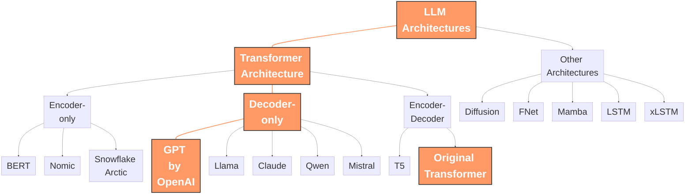
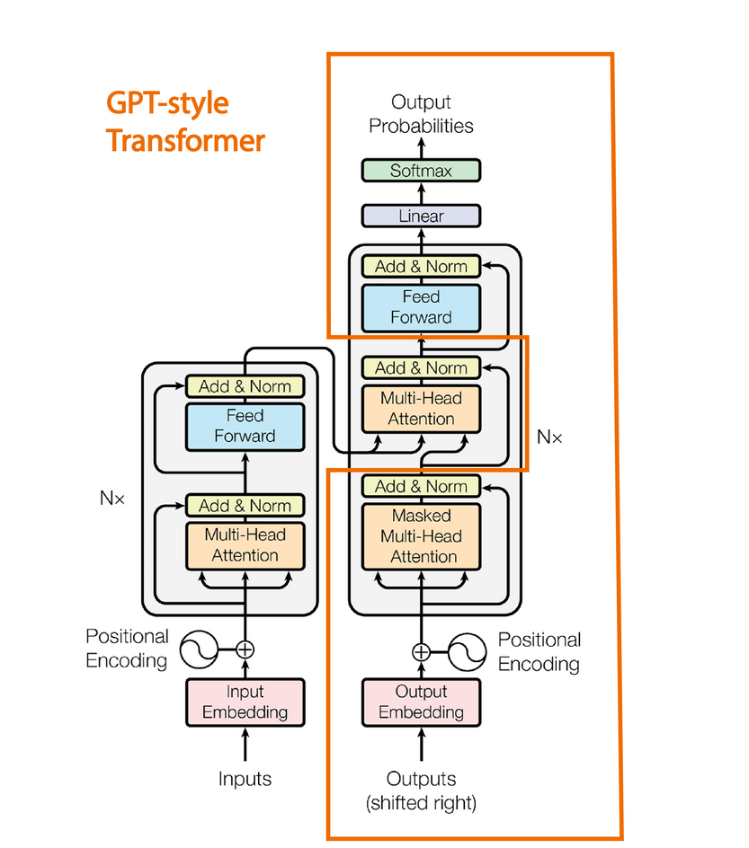
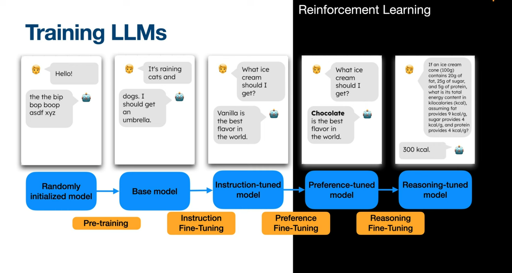

---
# try also 'default' to start simple
theme: seriph
# random image from a curated Unsplash collection by Anthony
# like them? see https://unsplash.com/collections/94734566/slidev
background: ./bg.png
# some information about your slides, markdown enabled
title: LLM Literacy for Post-LLM Programmer
info: |
  ## LLM Literacy for Post-LLM Programmer
  An opinionated, practical guide to vibe-coding in a vibing world, where not leveraging AI is like choosing horseback over air travel.

  By AARMN The Limitless
# apply any unocss classes to the current slide
class: text-center
# https://sli.dev/custom/highlighters.html
highlighter: shiki
# https://sli.dev/guide/drawing
drawings:
  persist: false
# slide transition: https://sli.dev/guide/animations#slide-transitions
transition: slide-left
# enable MDC Syntax: https://sli.dev/guide/syntax#mdc-syntax
mdc: true
---

<!-- 
TODO:
Licensing of these, open weight, open source, closed source, closed weight, ..., 
Ollama, and hand on
Open Web UI
tangent technologies, git, docker, vector dbs, python, 
good tooling vs common toolings
Know High-leverage tooling
key things to look for in an LLM
param count, context length, MoE, 

-->

# LLM Literacy for Post-LLM Programmer

An opinionated, practical guide to vibe-coding in a vibing world, where not leveraging AI is like choosing horseback over air travel.

  <a href="[Link to your socials/repo]" target="_blank" alt="GitHub"
    class="text-xl slidev-icon-btn opacity-50 !border-none !hover:text-white">
    <carbon-logo-github />
  </a>

---
transition: fade-out
---

# Who I am?

<!-- TODO: Add a picture of yourself or a relevant avatar -->

  <h3 class="text-xl">Alireza Mohammadnejad</h3>
  
Guilan University Student / LLM Enthusiast

  
Professional vibe-coder with a strong dedication toward optimization of workflows and automation

Why should you listen to me (for the next hour and a half, anyway)?

<v-clicks>

- I used LLMs since first preview of InstructionGPT
- I've built a lot of cool stuff using LLMs.
- I use LLMs daily
- I've made packages with (`pixelist`) and for (`vibecopy`) AI ...
- I improve my workflows constantly.
- I don't have an H100 GPU in the garage, just like you.
- My main goal: to demystify AI and help you leverage it.

</v-clicks>

---
layoutClass: gap-16
---

---
layoutClass: gap-16
---

# Let's Take a Look at Highlights of Announcements From the Last Week!

<v-clicks>

- 

    
    AlphaEvolve By Google
  

- 

    
    Gemini Diffusion By Google
  

- 

    
    Bagel by Bytedance
  

- 

    
    Claude 4 models by Anthropic
  

- 

    
    Codex (New) by OpenAI
  

- 

    
    Gemini 2.5 Flash Preview (05-20) by Google
  

</v-clicks>

<v-clicks>

## Therefore Keep in Mind

<AlertBox type="warning">
AI never sleeps<s>, and you shouldn't either</s>. Update your high leverage tools, but focus on learning fundamentals deeply!
</AlertBox>

</v-clicks>

<!--
Mention Gemma3n as well, which we can guess from its size, but no info about it is released and its format as a new unique format, never before seen.

Mention these is two path toward it based on this info
-->

---
transition: fade-out
---

# What I want you to take away?

<v-clicks>

- **What** is an LLM? <!-- (And how does it "think"?) -->
- How a model is different from a Provider?
- How to **make** an LLM? <!-- (The 10,000-foot view) -->
- Why LLMs are not a **fad**? 
- What is **todays (and maybe not tomorrow!)** SoTA, by vibes and benchmarks?
- Why LLMs **on their own** are not a **silver bullet**? <!-- (downsides and how to migate them using The tooling and human element) -->
- Which workflows and toolings elevate LLM to next-level?
- How to Ask the right questions? (The art and science of prompting) <!-- (The art of Prompt Fu) -->
- How to run a model on your very own system? (and not the big brother's cloud!)
- Whats next? (Learning insight and not riding hype-trains)

</v-clicks>

<!--
This is our roadmap. Each point will be expanded.
-->

---
transition: fade-out
---

# Necessary Ingredients for a Model

<v-clicks>

- **Architecture**: The blueprint of how the model should function, how parts interact and learn or not from data. It's the math and code of the machinery. It describes how model learns, often by tuning some internal "knobs" (parameters) based on the data it sees.

- **Parameters**: 
  - The internal "knobs" the model tunes during training
  - More knobs = more capacity to learn nuance 
  - Insight is stored in here!
  - this is the largest part of the final model artifact.

- **Training Data**: Differs from model to model, and from step to step, but initially, it's terabytes of text and code. The internet, basically. the pre-training phase is currently the most data hungry part of the process.

- **Computation and Energy**: The raw power calculation, commonly including learning and inference. Learning models, which are the foundation of modern AI, including LLMs, require learning from data, before or interleaved with their inference (usage) stage. This ~~is~~ was the most expensive part of the process, in terms of computation; which therefore, translates to time and money.

</v-clicks>

---
transition: fade-out
---

# A little analogy

<v-clicks>

### Human child

</v-clicks>

<v-clicks>

- **Architecture**: DNA, the blueprint of how the child should function, how parts interact and learn or not from data.

- **Parameters**: The internal "knobs" the child tunes during learning, from birth to adulthood. this can be their neurons connections, their muscles shape, ...

- **Training Data**: The experiences, interactions, and observations the child encounters from birth to adulthood. This data shapes the child's understanding of the world and how they interact with it.

- **Computation and Energy**: The child's brainpower and the energy it expends to learn and grow. handled by the food they eat. It's the rolling of DNA into a human being which happens since egg cells forward, powered by energy and chemical reactions.

</v-clicks>

---
transition: fade-out
---

# Commonly Used Jargon: Decoding the Lingo

<v-clicks>

- **Language Model (LM):** Any system (often AI-based) that models (understands and/or generates using probabilities) human language. Think autocompletes from a decade ago, but also modern giants.

- **Large Language Model (LLM):** An LM, but **BIG**.
  - **Large** in terms of:
    1. **Parameters** (more than a billion) <!-- main ingredient of the Large badge -->
    2. **Training Data** (have terabytes of training data)
    3. **Generalized capabilities** (across tasks, domains, languages)

- **Multimodal / VLM (Vision Language Model):** LLMs that can process and understand information from multiple types of data, not just text. Common combo is text + images.
  - *Examples:* GPT-4o (closed-weight), Llava (open-weight).

- **SoTA (State-of-the-Art):** The best-performing model/technique for a specific task *right now*.
- **Cutting-edge/Bleeding-edge** Very new, promising, but maybe not fully proven or widely adopted SoTA.

</v-clicks>

<!--
Presenter Notes for "Commonly Used Jargon":

- Language Model (LM):
  - Vibe check: The OG, could be anything from n-grams to simple neural nets.
  - LM is the foundational concept.

- Large Language Model (LLM):
  - Vibe check: The current rockstars. GPT-4, Claude 3, Gemini, Llama 3.
  Billions (sometimes trillions!) of internal "knobs" the model tunes during training. More knobs = more capacity to learn nuance (and also more to go wrong!).
  Terabytes of text and code. The internet, basically.

  - Emphasize the scale difference (Parameters, Training Data) and its implications.

- Multimodal / VLM:
  - Vibe check: "My LLM can see now! And it's judging my messy desk."
  - This is where things get really interesting – beyond just text. Mention examples.

- SoTA / Cutting-edge / Bleeding-edge:
  - Vibe check: SoTA is what you use for production. Bleeding-edge is what you brag about on X/Twitter.
  - Clarify these terms as they are often used loosely. The "right now" part of SoTA is key due to rapid changes.
-->

---

# A Skewed Map of Language models Realm

<v-clicks>

<AlertBox type="warning">
  This is a skewed map of the LLM realm focused on Assistants and modern LLMs. It's not meant to be exhaustive, but rather to give you a sense of the landscape.

  From now on, "AI" and "LLM" by default points to Decoder-only, Attention-based Transformers, a revision of OpenAI, on Transformers paper called "Attention is all you need" by Google Deepmind
</AlertBox>

</v-clicks>

---
layout: two-cols
---

# So, What is a GPT (Decoding Transformer)?

<v-clicks>

- Next word prediction system!
- Tokens!
- Context!
- Parallelism!
- **Relatively** Uncapped Learner!

</v-clicks>

::right::

---
layout: two-cols
---

# I Want to Make One!

Making an LM, is a great project for a resume, but, making an LLM is a financial and technical **mission impossible**. It's a *monumental* undertaking. Not your bachelor's degree project (unless you're a FAANG with a spare million or billion).

**The Typical Lifecycle:**

<v-clicks>

1. **Data Collection & Curation**
  - Download Everything off the Internet! (including copyrighted material 😉)
  - Use public datasets on 🤗HuggingFace and Kaggle (won't be enough for SoTA LLMs)
2. **Pre-training (Foundation Model)**
  - Write some code, do some math
  - Through your Dataset to your model
  - Iterate till it learns to predict next words

</v-clicks>

::right::

<v-clicks>

3. **Fine-tuning (Instruction Tuning & Alignment):**
  - The list of techniques in this section is so long, I won't even try to list them!
4.  **Evaluation & Red Teaming:**
  - Test on benchmarks, human evaluations.
  - "Red Teaming": Try to make it say bad/wrong/biased things to find and fix flaws.

</v-clicks>

<AlertBox v-click type="success">
This is why building a <b>competitive</b> LLM from scratch is mostly for mega-corps or well-funded research labs. Most of us will be <b>using</b> or <b>fine-tuning existing</b> models. (Including Iranian LLM projects you see in the wild)
</AlertBox>

<!-- 
    - Scrape the internet (Common Crawl), books, code, articles.
    - **Cleaning & Filtering:** Remove PII, hate speech, low-quality content. This is CRUCIAL and hard.
    - *Vibe:* Digital dumpster diving, then gold panning.

        - Goal: Learn general language patterns, grammar, facts, reasoning.
    - Method: Self-supervised learning (e.g., predict masked words, next sentence) on the massive curated dataset.
    - Hardware: Thousands of GPUs running for weeks/months. $$$$$!
    - *Result:* A "foundation model" that knows a lot but isn't very good at following instructions yet (e.g., GPT-3 base).

    Train on high-quality instruction-response pairs (e.g., "Q: Summarize this. A: [summary]"). Makes it follow instructions.
    - **Reinforcement Learning from Human Feedback (RLHF) / Direct Preference Optimization (DPO):**
        - Humans rank different model responses to the same prompt.
        - A "reward model" is trained on these preferences.
        - The LLM is further tuned to maximize scores from the reward model.
        - Goal: Make it more helpful, harmless, and honest.
    - *Vibe:* Sending the raw genius to finishing school.
-->

---

# Ok, Let's Explain Those Tuning Techniques a bit!

- Fine-tuning Steps!
  - Supervised Fine-Tuning (SFT)
  - Reward Modeling (RLHF / DPO)
  - Preference Tuning (PPO)
  - GPRO
  - CoT
  - Hyper
- Making small models go further
  - Knowledge Distillation
  - Quantization
- Making all models go further
  - Chain of Thought

---

###### borrowed from Julia Turc Youtube channel

---

# A Deep-dive for AI Enjoyers

## An example from Qwen 3

<!--
وقتی این مدلا تازه ترین شدن فقط می‌تونند کلمه بعد رو بهمند
-->

---
layout: center
effect: fade
---

# What is in the Magic Box?

## A Lot More, But We Got No Time For:

 

- Attention Mechanism
- Cold-Start
- Math
- Optimizers
- ...

---
transition: fade-out
---

# Why LLMs are NOT a Fad

<!-- lossy compression-->

<v-clicks>

### Why Industrial Revolution Succeeded?

It elevated the physical strength of human in specific operations, which boosted manufacturing.

### How Computers Revolution Succeeded?

It elevates the computational strength of human in specific operations, which boosts knowledge work.

### How AI Revolution ... ?

It elevates the cognitive strength of human in specific operations, which automates knowledge work.

<AlertBox type="info">
Just like computers, electricity and steam engines, LLMs are a general solution for a diverse set of problems!
</AlertBox>

</v-clicks>

---
transition: fade-out
layout: center
---

# LLMs are No More Specialist AI, they are Generalist

---
transition: fade-out
---

# Why LLMs are NOT a Fad

### But, It can't write good code? right?!

If you mean out-dated code, sure, it's still an open problem, but in the right, agentic environment, it can write better code than 95% of programmers, and if context-length issue and updating knowledge issue somehow be resolved, it can write better code than 99.99% of programmers.

### I want to know my code details fully and Engineer it, don't take that away from me!

Well, with that mentality you can never be a good technical-lead engineer, you can't write all the code, you barely can read all the code! if you can't verify LLM code, you can't verify a junior code when you are a senior either! Communicate with LLM, just like a human, assuming that person has dementia and write code super fast!

#### A fact to accept
LLMs are not mainly a replacement for human intelligence, but they are a replacement for human effort. 
It doesn't mean they are not intelligent, it means if you are not visionary, you are doomed! You can't out-compete a computer in speed of typing or count of doc pages read!

---
layout: center
---

# If Definition of a limit is Being fidgeted with, that limit probably is surpassed already!

<v-clicks>

###### What is Art?

###### Is Human Creativity Special?

###### Is Human Intelligence Special?

###### Can Machine Surpass us?

###### When AI will be, an AGI or ASI?

</v-clicks>

---
layout: center
---

# Singularity is not over the horizon, it's here!

---
layout: center
---

# One more reason, why it's not going anywhere, anytime soon

<v-clicks>

You are probably using it! and by demand, comes market!

It's just a matter of lowering the price enough!

So, yeah, this is not NFTs (sorry not sorry).

</v-clicks>

---
layout: two-cols
---

# But, LLMs are NOT Silver Bullet

They're incredibly powerful, but they're not magic. Think of them as brilliant, hardworking, and sometimes erratic, interns with great general-knowledge but not much of domain-specific experience, and they forget nearly everything the next day you visit them!

<v-clicks>

- **Context Length Limitations:**
  - Can only "remember" a certain amount of text (the context window). Getting MUCH better (e.g., Gemini 1.5M tokens, Claude 200k), but still a factor for very large tasks. Humans have smart context purge which LLMs currently lack

</v-clicks>

::right::

<v-clicks>

- **Hallucinations / Confabulation:**
  - They can make stuff up *very confidently*. They are optimized to produce plausible text, not necessarily *true* text

- **Lack of True Grounding / World Model:**
  - Don't *understand* concepts in a human way. It's sophisticated pattern matching.
  - This leads to subtle (and sometimes not-so-subtle) errors in reasoning or common sense.

- **A Brain Needs Hands (and Eyes, and Ears...):**
  - LLMs generate text. To *do* things in the real world (or digital world), they need to be connected to tools, APIs, databases. (This is where RAG and Agents come in).

</v-clicks>

---
transition: fade-out
---

# But, LLMs are NOT Silver Bullet

<v-clicks>

- **Many Models Does Not Support Multi-Modality Natively**
  - There are tricks used like OCR, for models like deepseek to read pdf, images, ... but understanding all models often comes with a hefty cost on model intelligence, or cost of development, or both!

- **Not Strategic By Default:**
  - They excel at executing well-defined tasks given in the prompt. Complex, multi-step problem-solving requires careful prompting or orchestration (e.g., agentic frameworks).

- **Human Expertise is Still King (or at least, Regent):**
  - **By the time I'm typing this** LLMs are **amplifiers**. They amplify good input and expertise. They also amplify bad input or lack of domain knowledge.
  - Critical thinking, validation, and domain knowledge from humans are ESSENTIAL.

</v-clicks>

<v-clicks>

*Key takeaway:* LLMs are a *component*, not a whole solution. They need to be part of a larger system, often with human oversight.

</v-clicks>

---
transition: fade-out
---

# Model vs. Provider: Who's Who?

This is a common point of confusion, specially for non-technical people. Let's clear it up.

<v-clicks>

- **Model:** The actual AI, the "brain." It's the result of the training process.
    - *Examples:* `GPT-4 Turbo`, `Claude 4 Opus`, `Gemini 2.5 Flash`, `o4-mini` `Llama 3 70B`.
    - These are specific versions with defined capabilities and architectures.

- **Provider (or Product/Service):** The company or platform that hosts the model(s) and provides access, often via an API or a user interface.

</v-clicks>

<AlertBox type="info" title="Analogy Time!">
Think of it like cars:

- **Model:** Ford Focus ST (the specific car with its engine, features)
- **Provider:** The Ford Dealership (where you get it), or Hertz (if you're renting access to drive it).

</AlertBox>

---

# What a Provider Does?

- Run the model(s)
- Provide an API (or a chat interface)
- Tooling for the model
  - Search-engine results for overcoming cut-off
  - Vector DB to query relevant materials
  - Code Runner
- Handle billing and access control
- Handle auxiliary services
  - TTS for hearing answers (another AI!)
  - STT for typing using voice (even another AI!)
  - Memory services
  - Set the right hyperparameters
  - Image gen, ...

---
transition: fade-out
layout: center
---

# Fast Hyperparameter Explanation... 

---
layout: center
---

# Let's Get Hands-on

---

# The Art of Asking the Right Questions

To get correct answers, you first need to know, what you want, and how to ask for it.

<CardDeck :items="promptingTips" :highlightIndex="0">
</CardDeck>

<!-- Just like humans, AIs cant read your brain (yet) so ask your question -->

---
transition: fade-out
layout: center
---

# Let's Get Hands on for Tooling!

---
transition: fade-out
---

# Random tips for developing with LLM

- learn `git` better than ever!
- LLMs have knowledge cut off! 
- containerize everything!
- Vector DBs

---
transition: fade-out
layout: center
---

# How to Run a Model Locally (Your Private LLM!)

---

# Vibecode!

- Andrej Karpathy
- IDEs
  - Cursor (VSCode Fork)
  - Trae (VSCode Fork)
  - Windsurf (VSCode Fork)
  - Void (VSCode Fork)
- Extensions (for VSCode)
  - Github Copilot
  - RooCode
  - Augment
  - Cline
  - Blackbox
  - Lingma
  - Trae, Windsurf plugins
- Vibe Studios!
  - Bolt.new
  - Lovable
- Github App
  - Code Rabbits

---
transition: fade-out
layout: center
class: text-center
---

# Are you Interested? What's Next? 
Keeping Up & Moving Forward

---
layout: center
---

# Important Tip before moving forward

 
<v-clicks>
<AlertBox type="warning">
You <b>cannot</b> learn everything in the world of AI!   Aim for <b>strategic sips</b>. after you found what makes you excited.   Be <b>deep</b> in something, and follow the news in other
</AlertBox>
</v-clicks>

---

# Opportunities

- Organization of Agents
- Opinionated integrations
- LLM Routing
- MCP Server and Other tooling markets
- n8n-like GUI automations
- Text-defined alternatives to slides, diagrams, ...
- Edge Devices Deployment
- Multi-modality 
- Connecting the dots
- Robotics (Nvidia)
- Chips (Nvidia)
- Fine-tuning for special-domains
- New Architectures?

---
layout: center
---

# How to Expose Yourself to LLM Community

### Follow Key People and Channels:

 

<PersonCard :people="aiExperts">
</PersonCard>

---

**How to "Learn" More & Stay Updated:**
<v-clicks>

- **Read Blog Posts:** OpenAI, Anthropic, Google AI blogs. AI Snake Oil by Arvind Narayanan & Sayash Kapoor for critical perspectives.
- **Key Papers on arXiv:** Look for highly cited / trending papers in `cs.CL` (Computation and Language), `cs.AI`, `cs.LG` (Machine Learning).
- **Newsletters:** AI Alignment Newsletter, The Batch, Last Week in AI.
- **Communities:** Hugging Face forums, Reddit (r/LocalLLaMA, r/MachineLearning), Discord servers.
- **Experiment!** The best way to learn is by doing. Pick a model, try to build something small.

</v-clicks>

**Future Vibe (Speculative but Grounded):**
<v-clicks>

- **Deeper Multimodality:** LLMs that seamlessly understand and generate across text, image, audio, video, maybe even other sensor data.
- **Longer, More Effective Context:** Less "goldfish memory."
- **Improved Reasoning & Reliability:** Fewer hallucinations, better step-by-step logic.
- **More Capable Agents:** LLMs that can reliably use tools, plan, and execute complex tasks with less human hand-holding.
- **Personalization & Specialization:** Models fine-tuned for specific domains, industries, or even individuals.

</v-clicks>

<!-- با همه فاجعه شدن ها هنوز خیلی خوبه-->

---

# Guessing the Future

---

# Homework :)

<v-clicks>

1.  **Try a local model:** Install ollama, LM Studio, open-webui or all of the above! Download Llama 3 8B or Phi-3-mini. Chat with it.
2.  **Experiment with Prompt Engineering:** Take a task you do regularly (writing an email, summarizing text, generating code snippets) and try to get an LLM (local or cloud) to do it via careful prompting. Iterate at least 5 times on your prompt.
3.  **Explore one LLM-powered tool:** If you code, try Cursor or GitHub Copilot for a week. If you research, try Perplexity.
4.  **Read one "intro to RAG" article or watch a short video.** Understand the basic concept.

</v-clicks>

---
layout: center
class: text-center
---

# Questions? & Thank You!

Let's vibe and discuss.

 

This is just a dip into the ocean of LLM literacy, a lot left unsaid, and a lot remains in fog of mystery. Stay curious, keep experimenting, and don't be afraid to ask a **dumb** questions. The field is new for everyone!

Your presence mean to me as much as count of GPT4.5 parameters

Connect with me:

 
 

